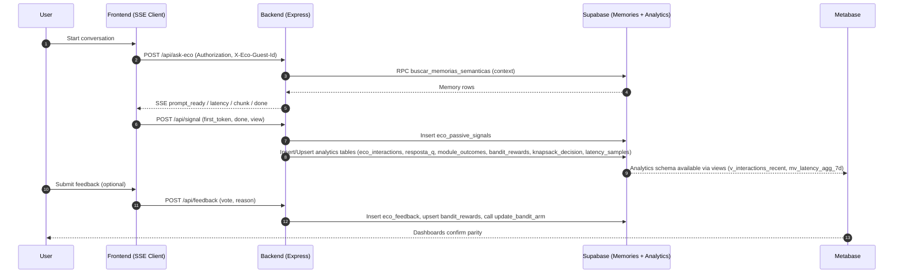

# ECO System 1:1 Documentation

## Summary
- Express backend serves `/api/ask-eco` streaming replies plus telemetry, `/api/signal` passive events, `/api/feedback` rewards, and `/api/guest/claim` guest upgrades behind shared middlewares (CORS, guest identity, rate limits).
- Frontend hooks (`startEcoStream`, `streamConversation`, `postSignal`) manage SSE playback, guest headers, and lifecycle analytics in lockstep with backend expectations.
- Supabase hosts long-term memories (`public.memories`), temporary references, conversational analytics (`analytics.*` tables), and RPC helpers wired from the orchestrator and feedback flows.
- Metabase consumes the analytics schema (direct tables and read-only views) for observability; sequence diagram below maps the end-to-end flow.

## Backend Overview
- **Express app** (`server/core/http/app.ts`): preflight CORS, JSON parsing, guest identity cookies, per-token rate limiting, and route registration under `/api/*`. SSE route `/api/ask-eco` is exposed directly before other prompt endpoints for low-latency streaming. Health checks `/`, `/healthz`, `/api/health`, `/readyz` provide deployment probes.
- **Conversation orchestration** (`server/routes/promptRoutes.ts`, `server/services/ConversationOrchestrator.ts`):
  - Normalizes body payloads accepting `{messages[]}`, `{text}`, or `{mensagem}` fields, resolves guest/session identifiers, and toggles SSE if `Accept: text/event-stream` or `stream=true`.
  - Streams tokens through SSE (`prompt_ready`, `first_token`, `chunk`, `latency`, `done`) while capturing the interaction id emitted by the orchestrator. Passive signals (prompt ready, done) queue until the interaction id is known, then insert into `analytics.eco_passive_signals`.
  - Conversation orchestrator persists analytics batches per response: `analytics.eco_interactions` (insert/update), `analytics.resposta_q`, `analytics.module_outcomes`, `analytics.bandit_rewards`, `analytics.knapsack_decision`, `analytics.latency_samples`, plus heuristics events when present.
  - Memory retrieval uses Supabase RPC `public.buscar_memorias_semanticas` to merge `public.memories` and `public.referencias_temporarias` with token budgets, similarity scores, and recency weights.
- **Signal intake** (`server/controllers/signalController.ts`): rate-limited POST storing lifecycle and engagement events into `analytics.eco_passive_signals`, enforcing UUID interaction ids and safe metadata cloning.
- **Feedback intake** (`server/controllers/feedbackController.ts`): accepts explicit votes, infers module arm when absent, records rows in `analytics.eco_feedback`, upserts `analytics.bandit_rewards`, then runs RPC `analytics.update_bandit_arm` to update Thompson sampling priors.
- **Guest upgrades** (`server/routes/guestRoutes.ts`): authenticated users claim guest history, migrating `public.referencias_temporarias` rows and blocking the guest id to avoid reuse.

## Frontend Overview
- **Streaming client** (`web/src/api/ecoStream.ts`, `web/src/api/chatStreamClient.ts`):
  - `startEcoStream` POSTs JSON to `/ask-eco` with `Authorization: Bearer <token>` and optional `X-Eco-Guest-Id`, decoding SSE chunks into normalized events for immediate rendering.
  - `streamConversation` wraps the transport to aggregate text, expose lifecycle callbacks, emit latency analytics, persist the returned `interaction_id`, and trigger passive signals (`first_token`, `done`, `view`).
  - Headers expected by backend: `Authorization`, `Content-Type: application/json`, and guest id header; responses may echo `X-Eco-Guest-Id` for storage.
  - SSE events consumed: `prompt_ready` (pipeline ready), `latency` stages (`prompt_ready`, `ttfb`, `ttlc`), `chunk` (text delta), `done` (final metadata), `error` (fallback handling).
- **Signal hook** (`web/src/api/signals.ts`): posts `{signal, interaction_id, value?, session_id?, meta?}` to `/api/signal` with stored guest header; gracefully ignores network failures while persisting returned guest ids.
- **Guest utilities** (`web/src/utils/guest.ts`): normalizes UUID-based guest ids, stores them in localStorage, and hydrates request headers so backend session middleware can stitch analytics and rate limiting per guest.

## Supabase Schema Summary
### Public Schema (Memory)
#### `public.memories`
| Column | Type | Purpose |
| --- | --- | --- |
| `id` | `uuid` | Primary key for persisted memory. |
| `usuario_id` | `uuid` (FK auth.users) | Owner of the memory, cascades on delete. |
| `mensagem_id` | `uuid` | Optional originating message id. |
| `referencia_anterior_id` | `uuid` | Chain to previous reference for context linking. |
| `texto` | `text` | Full memory content. |
| `resumo_eco` | `text` | Backend-generated summary. |
| `tags` | `text[]` | Structured labels for retrieval filters. |
| `dominio_vida` | `text` | Life domain classification. |
| `emocao_principal` | `text` | Leading emotion tag. |
| `intensidade` | `smallint` (0-10) | Emotional intensity gate (>=7 persists). |
| `nivel_abertura` | `smallint` | Disclosure level for heuristics. |
| `padrao_comportamental` | `text` | Behavioral pattern analysis. |
| `categoria` | `text` | Memory categorization for UI. |
| `analise_resumo` | `text` | Model analysis snippet. |
| `pin` | `boolean` | Pinned for forced recall. |
| `salvar_memoria` | `boolean` | Flag confirming permanent storage. |
| `embedding` | `vector(1536)` | Semantic embedding for retrieval. |
| `embedding_emocional` | `vector(256)` | Emotional embedding for affect matching. |
| `token_count` | `integer` | Auto-generated estimated token usage. |
| `created_at`/`updated_at` | `timestamptz` | Audit timestamps with triggers maintaining freshness. |

#### `public.referencias_temporarias`
Same shape as `public.memories` but `salvar_memoria` defaults false and includes `expires_at` to age out low-intensity (<7) references.

#### RPC `public.buscar_memorias_semanticas`
- **Inputs:** `p_usuario_id`, `p_query` (vector), optional `p_query_emocional`, `p_tags`, `p_emocao`, `p_include_referencias`, `p_limit`, `p_token_budget`, `p_lambda_mmr`, `p_recency_halflife_hours`, `p_pin_boost`.
- **Outputs:** rows with origin (`memories` or `referencias_temporarias`), ids, content, tags, emotion fields, composite and component scores, honoring MMR and token budgets.

### Analytics Schema
#### `analytics.eco_interactions`
| Column | Type | Purpose |
| --- | --- | --- |
| `id` | `uuid` | Primary interaction/response id referenced by all analytics tables. |
| `user_id` | `uuid` | Authenticated user when available; nullable for guests. |
| `session_id` | `text` | Front session glue (via `X-Eco-Session`). |
| `message_id` | `text` | Upstream message guid. |
| `prompt_hash` | `text` | Template hash to correlate experiments. |
| `module_combo` | `text[]` | Modules triggered during orchestration. |
| `tokens_in`/`tokens_out` | `int` | Token usage summary. |
| `latency_ms` | `int` | Total time-to-last-chunk. |
| `created_at` | `timestamptz` | Insert timestamp. |

#### `analytics.eco_feedback`
Stores `{interaction_id, user_id, session_id, vote enum('up','down'), reason[], source, meta, created_at}` to track explicit votes.

#### `analytics.eco_passive_signals`
Captures `{interaction_id, signal, meta, created_at}` for lifecycle telemetry (prompt ready, first token, view, etc.).

#### `analytics.eco_module_usages`
Links module execution to interactions with `{module_key, tokens, position, created_at}`.

#### `analytics.eco_bandit_arms`
Maintains Thompson sampling priors `{arm_key, pulls, alpha, beta, reward_sum, reward_sq_sum, last_update}` updated via RPC.

#### `analytics.bandit_rewards`
Per-response reward rows `{response_id, pilar, arm, recompensa, created_at}` supporting reward history and dedupe constraint on `(response_id, arm)`.

#### `analytics.resposta_q`
Quality envelope with `{response_id, user_id, retrieve_mode, q, estruturado_ok, memoria_ok, bloco_ok, tokens_total, tokens_aditivos, ttfb_ms, ttlc_ms, created_at}`.

#### `analytics.module_outcomes`
Module-level quality contributions `{response_id, module_id, tokens, q, vpt, created_at}`.

#### `analytics.knapsack_decision`
Records additive budget solver output `{response_id, budget, adotados jsonb, ganho_estimado, tokens_aditivos, created_at}`.

#### `analytics.latency_samples`
Latency trace rows `{response_id, ttfb_ms, ttlc_ms, tokens_total, created_at}`.

#### `analytics.eco_policy_config`
Mutable policy/budget configuration store `{key, tokens_budget, config jsonb, updated_at}`.

#### Views and helpers
- `analytics.v_feedback_recent`, `analytics.v_interactions_recent`, `analytics.v_latency_recent` expose 90-day windows for Supabase REST v2 / Metabase.
- Materialized view `analytics.mv_latency_agg_7d` summarizes latency statistics per day.
- RPC `analytics.update_bandit_arm(p_arm_key, p_reward)` increments Thompson sampling parameters per arm.

## API Contract Table
| Method | Endpoint | Request Body | Response | Supabase Touchpoints | Frontend Hook |
| --- | --- | --- | --- | --- | --- |
| POST | `/api/ask-eco` | `{ messages[]? \| text? \| mensagem?, nome_usuario?, usuario_id?, sessionMeta?, stream? }` plus headers `Authorization: Bearer`, `X-Eco-Guest-Id?`, `X-Eco-Session-Id?` | SSE stream (`prompt_ready`, `latency`, `chunk`, `done`) or JSON `{ content }` when SSE disabled | RPC `public.buscar_memorias_semanticas`; tables `analytics.eco_interactions`, `analytics.resposta_q`, `analytics.module_outcomes`, `analytics.bandit_rewards`, `analytics.knapsack_decision`, `analytics.latency_samples`, `analytics.eco_passive_signals` | `startEcoStream` → `streamConversation` (renders text, emits analytics) |
| POST | `/api/signal` | `{ signal, interaction_id, value?, session_id?, meta? }` with headers `X-Eco-Guest-Id?`, `X-Eco-Session-Id?` | `204 No Content` (`429` on rate limit, `400` invalid interaction) | `analytics.eco_passive_signals` | `postSignal` (lifecycle + engagement pings) |
| POST | `/api/feedback` | `{ interaction_id?, response_id?, vote: "up"|"down", reason?, pillar?, arm? }` headers optionally include guest/session ids | `204 No Content` (`400` when missing ids) | `analytics.eco_feedback`, `analytics.bandit_rewards`, RPC `analytics.update_bandit_arm`, lookup `analytics.eco_module_usages` | Feedback UI (TODO) — ensure request mirrors backend contract |
| POST | `/api/guest/claim` | Auth header `Bearer <user token>`; body `{ guestId \| guest_id \| id }` | `200 { migrated }` or `401/400/500` | `public.referencias_temporarias` (updates owner), guest session cache invalidation | Account linking screen (TODO) — must pass stored guest id |

## Front–Back Connection Map
- `streamConversation` → `/api/ask-eco` → orchestrator → Supabase analytics inserts; frontend renders `chunk` events, logs latencies, and persists `interaction_id` for downstream calls.
- `streamConversation` lifecycle callback → `postSignal("first_token"|"done"|"view")` → `/api/signal` → `analytics.eco_passive_signals`.
- Future feedback component will reuse stored `interaction_id` to POST votes to `/api/feedback`, feeding `analytics.eco_feedback` and updating bandit priors before surfacing dashboards in Metabase.
- Guest claim flow will promote `guest_id` to auth user id, ensuring subsequent `/api/ask-eco` runs load consolidated memories from both `public.referencias_temporarias` and `public.memories`.
- Metabase dashboards query `analytics.*` tables and views (e.g., `analytics.v_interactions_recent`, `analytics.mv_latency_agg_7d`) for parity checks against frontend telemetry.

## Sequence Diagram (Mermaid)

## Launch Checklist
- [ ] Confirm analytics parity: for each streamed response, verify `interaction_id` exists across `eco_interactions`, `eco_passive_signals`, `resposta_q`, and latency tables.
- [ ] Validate headers: frontend sends `Authorization`, `X-Eco-Guest-Id`, `X-Eco-Session-Id` (if available) and stores returned guest id for reuse.
- [ ] Monitor latency: ensure SSE emits `prompt_ready`, `ttfb`, `ttlc`; check Supabase `latency_samples` and Metabase `mv_latency_agg_7d` for regressions.
- [ ] Guard memory saves: confirm intensity gating (`>=7`) keeps long-term memories in `public.memories` and short-term references in `public.referencias_temporarias`.
- [ ] Feedback loop: smoke-test `/api/feedback` to ensure bandit rewards and `update_bandit_arm` execute without conflicts.
