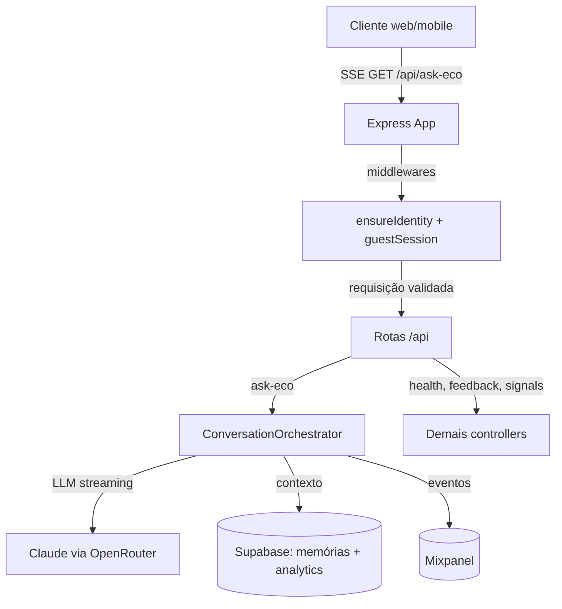

# ECO Conversational Backend

## Visão geral
O back-end da ECO orquestra um servidor Express com suporte a streaming SSE, memória semântica no Supabase e instrumentação de analytics (Supabase + Mixpanel). Durante o boot ele carrega variáveis de ambiente via `dotenv`, valida se os módulos de prompt existem no diretório de assets e inicia agendadores como a sincronização de recompensas dos bandits.【F:server/server.ts†L5-L176】 A aplicação Express aplica CORS global, resolve identidade de convidados, impõe rate limit por token/guest/IP e expõe healthchecks e rotas do domínio conversacional (memórias, analytics, voz, policy etc.).【F:server/core/http/app.ts†L121-L331】

### Capacidades principais
- **Orquestração conversacional** – `/api/ask-eco` entrega respostas via SSE, aplicando validações de identidade, deduplicação de mensagens e fallback JSON.【F:server/routes/promptRoutes.ts†L592-L847】
- **Memórias semânticas** – Recupera memórias por RPC (`buscar_memorias_semelhantes_v2`) com filtros de similaridade, emoção e MMR antes de compor o prompt.【F:server/services/supabase/semanticMemoryClient.ts†L96-L198】【F:server/services/conversation/streamingOrchestrator.ts†L132-L213】
- **Analytics operacional** – Resultados são persistidos em tabelas `analytics.*` (qualidade, bandits, knapsack, latência) e os eventos Mixpanel seguem convenções de `distinct_id` para usuários e convidados.【F:server/services/analytics/analyticsOrchestrator.ts†L80-L151】【F:server/analytics/events/mixpanelEvents.ts†L8-L206】
- **Observabilidade embutida** – Logs estruturados informam CORS, erros de streaming e métricas de SSE; healthchecks expõem status dos módulos carregados e da configuração Supabase.【F:server/core/http/app.ts†L170-L331】【F:server/sse/sseEvents.ts†L187-L297】

## Como rodar localmente
1. **Instale dependências**
   ```bash
   cd server
   npm install
   ```
2. **Configure variáveis** – crie `.env` baseado nas chaves listadas em [ENVIRONMENT.md](ENVIRONMENT.md). Para analytics local rápido há um `.env.sample` com sinalizadores mínimos.【F:.env.sample†L1-L5】
3. **Rodando em desenvolvimento**
   ```bash
   npm run dev
   ```
   Executa `nodemon` com `NODE_ENV=development` monitorando os arquivos TypeScript.【F:server/package.json†L10-L18】
4. **Build e produção**
   ```bash
   npm run build
   npm start
   ```
   O build transpila TypeScript (`tsc`) e copia assets necessários antes de subir o servidor compilado (`dist/server.js`).【F:server/package.json†L12-L17】

### Pré-requisitos de assets e módulos
A inicialização falha se os módulos de prompt não estiverem presentes (ex.: `modulos_core/developer_prompt.txt`). O bootstrap soma arquivos no diretório `assets`, registra heurísticas opcionais e garante que os módulos de identidade estão prontos antes de aceitar requisições.【F:server/server.ts†L38-L177】 Use `npm run verify:assets` para validar a árvore de módulos antes do deploy.【F:server/package.json†L12-L14】

## Arquitetura

- **Edge/Express** – Configura CORS, parsers, rate limiting e aliases de rotas legadas.【F:server/core/http/app.ts†L121-L330】
- **Identity** – `ensureGuestIdentity` gera IDs convidados, `ensureIdentity` exige cabeçalhos `X-Eco-*` válidos e o `guestSessionMiddleware` limita uso anônimo.【F:server/core/http/guestIdentity.ts†L1-L120】【F:server/middleware/ensureIdentity.ts†L19-L117】【F:server/core/http/middlewares/guestSession.ts†L52-L194】
- **Orchestrator** – Seleciona módulos, chama LLM (Claude via OpenRouter) e transmite chunks enquanto registra analytics.【F:server/services/ConversationOrchestrator.ts†L1-L181】【F:server/services/conversation/streamingOrchestrator.ts†L84-L213】
- **Supabase** – RPCs de memórias, persistência de analytics e políticas RLS em `memories`/`referencias_temporarias`.【F:server/services/supabase/semanticMemoryClient.ts†L96-L198】【F:supabase/schema/memory_schema.sql†L12-L112】【F:supabase/schema/analytics_schema.sql†L1-L83】
- **Mixpanel** – Eventos encapsulados em `analytics/events/mixpanelEvents.ts` usam um cliente que vira no-op sem token para ambientes locais.【F:server/lib/mixpanel.ts†L6-L44】【F:server/analytics/events/mixpanelEvents.ts†L34-L206】

## Principais fluxos
- **Healthchecks** – `/`, `/health`, `/healthz`, `/api/health` retornam estado básico e status de módulos; `/readyz` confirma configuração Supabase para cenários de liveness/readiness em deploys.【F:server/core/http/app.ts†L170-L214】
- **Feedback & sinais** – `/api/feedback` grava votos com inferência de braço e recompensa; `/api/signal` aceita eventos passivos com rate limit independente.【F:server/controllers/feedbackController.ts†L32-L200】【F:server/routes/signalRoutes.ts†L9-L59】
- **Guest claim** – `/api/guest/claim` associa dados gerados como convidado a um usuário autenticado e bloqueia reuso do `guestId`.【F:server/routes/guestRoutes.ts†L70-L140】

## Principais insights e lacunas
- **Insights**
  - Garantia rígida de assets de prompt no boot evita respostas inconsistentes e falhas silenciosas em produção.【F:server/server.ts†L67-L133】
  - O pipeline de streaming usa watchdogs para `first_token` e `guard fallback`, reduzindo silêncio em falhas de LLM.【F:server/sse/sseEvents.ts†L184-L297】
  - Analytics é opcional: sem `SUPABASE_*` o serviço continua rodando, apenas registra logs de depuração.【F:server/services/analytics/analyticsOrchestrator.ts†L97-L165】
- **Lacunas**
  - Não há `.env.example` completo; apenas três flags de analytics são sugeridas em `.env.sample`. Recomenda-se publicar um exemplo cobrindo chaves críticas (OpenRouter, Supabase, Mixpanel).【F:.env.sample†L1-L5】
  - Monitoramento estruturado (metrics/alerts) fora dos logs não foi encontrado; sugerir integração com APM ou dashboards automáticos para SSE e Supabase (não encontrado).
  - Testes automatizados para rotas de streaming não estão documentados no README (há specs em `server/tests`, mas sem instruções aqui); incluir uma seção de testes seria útil (não encontrado na documentação atual).
