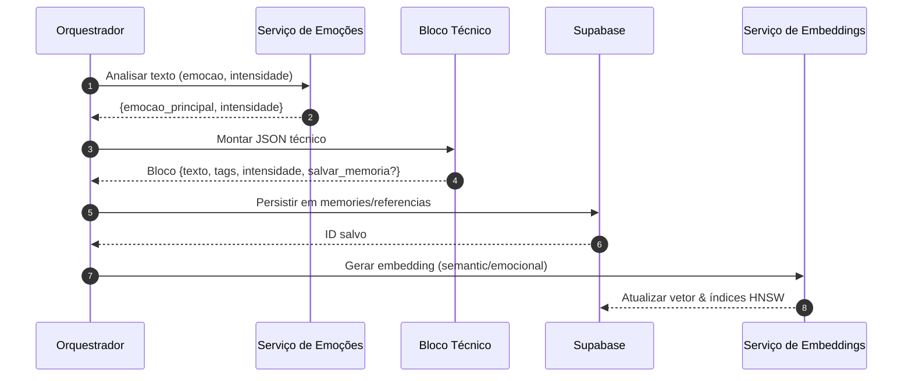
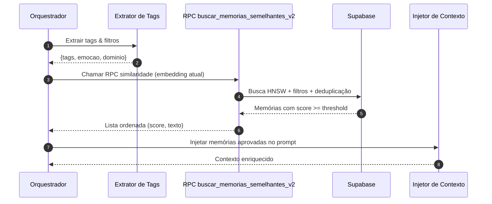

# Documentação do Subsistema de Memórias e Embeddings

## Modelo de dados

### Tabelas principais

- **`public.memories`**
  - Persistência de memórias emocionais com intensidade **≥ 7**.
  - Campos obrigatórios: `id`, `usuario_id`, `texto`, `intensidade`, `emocao_principal`, `tags`, `embedding`, `created_at`.
  - Campos auxiliares: `embedding_emocional`, `dominio_vida`, `referencia_anterior_id`, `mensagem_id`, `token_count`, `pin`, `updated_at`.
  - Validações essenciais:
    - `intensidade` na escala 0–10 (`CHECK`).
    - `texto` não vazio e `embedding` com dimensão consistente.
    - `usuario_id` obrigatório com RLS aplicada por usuário.
    - `tags` e `emocao_principal` obrigatórios para classificação semântica.

- **`public.referencias_temporarias`**
  - Armazena registros com intensidade **< 7**, servindo como staging de curto prazo.
  - Compartilha quase todo o esquema de `memories`, adicionando `expires_at` para expiração automática.
  - Regras de validação replicam as de `memories`, garantindo compatibilidade na promoção de uma referência para memória persistente.

### Regras de intensidade

1. Processamento emocional calcula `intensidade` na escala 0–10.
2. Se `intensidade ≥ 7`, o bloco é salvo diretamente em `memories`.
3. Se `intensidade < 7`, o conteúdo é gravado em `referencias_temporarias` e uma referência (ID/UUID) é devolvida para uso transitório.
4. Qualquer item pode ser "promovido" para memória recalculando intensidade ou por override humano (exige pin=true e atualização de `intensidade`).

### Tags e emoção

- `tags` é um array de texto normalizado em snake_case.
- `emocao_principal` segue taxonomia controlada (alegria, tristeza, ansiedade, etc.).
- Pelo menos uma tag é obrigatória; recomenda-se no máximo 5 para manter precisão nos filtros.
- Emoção secundária pode ser registrada em `metadados` (JSONB) quando disponível.

### Escala e validações

| Campo | Regra |
|-------|-------|
| `intensidade` | Float 0–10 com arredondamento para 1 casa decimal. |
| `texto` | Mínimo 3 caracteres, máximo 3.000 tokens (validado por `token_count`). |
| `tags` | Array não vazio; valores únicos. |
| `embedding` | Vetor `vector(1536)` (OpenAI) ou tamanho configurado. |
| `embedding_emocional` | Opcional, `vector(768)` (modelo emocional). |
| `dominio_vida` | Enum (`trabalho`, `relacionamentos`, `saude`, `financas`, `outros`). |
| `pin` | Booleano; `true` impede purga automática. |
| `expires_at` | Obrigatório em referências (< 7), máximo 30 dias à frente. |

## Fluxos em Mermaid

### Inserção de memória

### Recuperação de memória

## Referências SQL

| Objeto | Local | Observações |
|--------|-------|-------------|
| `public.memories` | `supabase/schema/memory_schema.sql` | Inclui índice HNSW (`embedding`) e `vector_cosine_ops`. |
| `public.referencias_temporarias` | `supabase/schema/memory_schema.sql` | Índice HNSW para embeddings temporários. |
| Índice HNSW | `CREATE INDEX ... USING hnsw (embedding vector_cosine_ops)` | `m=16`, `ef_construction=64`. |
| RPC `buscar_memorias_semelhantes_v2` | `supabase/functions/buscar_memorias_semanticas.sql` | Wrapper atualizado mantendo assinatura compatível. |
| Operador `vector_cosine_ops` | Extensão `pgvector` habilitada via `CREATE EXTENSION IF NOT EXISTS vector`. |

## Qualidade

- **Thresholds**
  - Similaridade mínima recomendada: `0.78` para contexto, `0.85` para respostas diretas.
  - Boost adicional (`+0.05`) para memórias com `pin = true`.
- **Deduplicação**
  - A RPC aplica penalização MMR (`lambda = 0.5`).
  - Conteúdos com `similarity > 0.97` são considerados duplicados e descartados.
- **Filtros por domínio**
  - Sempre enviar `dominio_vida` quando conhecido para evitar contaminação cruzada.
  - `tags` vazias devem abortar a busca (retornar fallback).
- **Métricas**
  - Registrar média móvel de `similarity` por sessão (janela 7 dias).
  - Monitorar p95 de latência da RPC e contagem de memórias por usuário.

## Checklists de debug

1. **Campos nulos**
   - Verificar `tags`, `emocao_principal`, `embedding` e `usuario_id` antes de persistir.
   - Confirmar `expires_at` em referências.
2. **Schema**
   - Validar migrações aplicadas (`supabase db diff` ou `psql \d`).
   - Checar versão da extensão `vector`.
3. **Índices**
   - `EXPLAIN` deve mostrar uso do índice HNSW (`using hnsw`).
   - `reindex` se notar degradação após importes massivos.
4. **Teste rápido de similaridade**
   - Usar RPC `buscar_memorias_semelhantes_v2` com embedding conhecido.
   - Confirmar retorno ordenado e scores consistentes (`>= threshold`).
   - Se vazio, baixar threshold temporariamente para diagnosticar.
