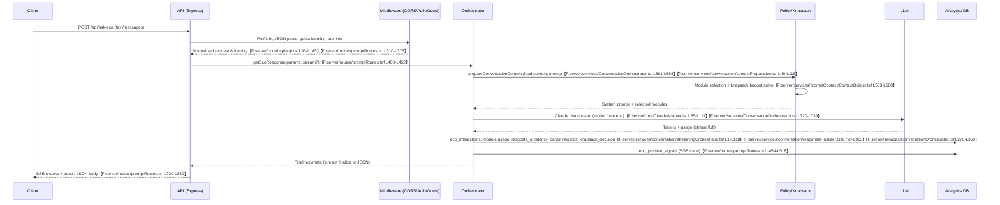
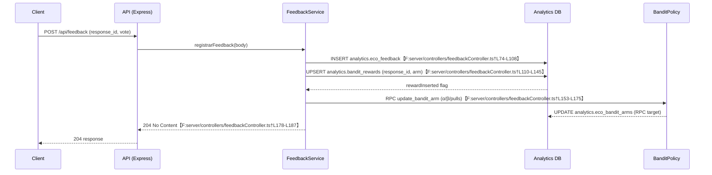
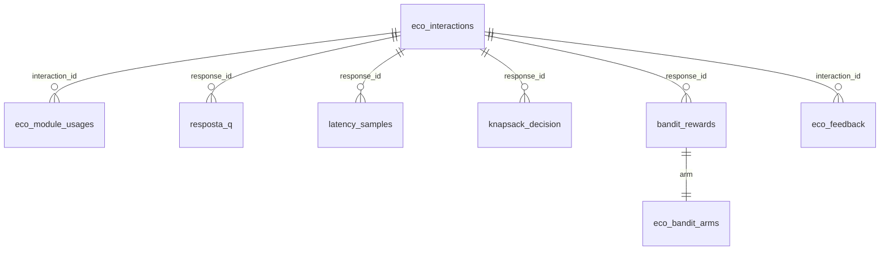

# Eco backend flow

> **Assumptions**
> - Module availability is driven by the runtime ModuleStore index over `server/assets/**`; no static `modules.manifest.json` was found, so references below assume the catalog built from that tree is up to date.【F:server/services/promptContext/ModuleStore.ts†L24-L120】

## Sequence Diagram — ask-eco


## Sequence Diagram — feedback & bandit


## Component diagram
```mermaid
flowchart LR
    subgraph Express
      App[createApp] -->|/api/ask-eco| AskRouter[promptRoutes.askEcoRouter]
      App -->|/api/feedback| FeedbackRouter[feedbackRoutes]
    end
    AskRouter -->|getEcoResponse| Orchestrator[ConversationOrchestrator]
    FeedbackRouter -->|registrarFeedback| FeedbackCtrl[feedbackController]
    Orchestrator --> Context[ContextBuilder & ResponsePlanner]
    Orchestrator --> Bandits[bandits/ts + analyticsStore]
    Orchestrator --> LLM[ClaudeAdapter]
    Orchestrator --> DBAdapter[SupabaseAdapter/Analytics]
    Context --> ModuleCatalog[ModuleStore + assets]
    Context --> PolicyCfg[eco_policy_config]
    Bandits --> Arms[analytics.eco_bandit_arms]
    FeedbackCtrl --> DBAdapter
    DBAdapter --> Supabase[Supabase (analytics schema)]
```

## Activity Diagram — context assembly
```mermaid
flowchart TD
    Start([user_text, optional perfil, passive signals]) --> LoadPolicy[loadConversationContext + policy config]
    LoadPolicy --> Manifest[ModuleCatalog.load assets]
    Manifest --> Knapsack[solveKnapsack(budget, candidates)]
    Knapsack --> Adopted[Adopt modules + pinned set]
    Adopted --> Stitch[stitchModules + applyReductions]
    Stitch --> Constraints[planBudget + token cap]
    Constraints --> Output[system prompt + messages ready]
```

## Analytics ER snapshot (analytics schema)


## Overview
The backend exposes `/api/ask-eco` for conversational responses and `/api/feedback` for post-response votes, both layered on an Express app that handles CORS, guest identity, and rate limits before delegating to service controllers; each response is orchestrated through context assembly, policy/knapsack gating, LLM calls, and a Supabase analytics sink keyed by `response_id = eco_interactions.id`.【F:server/core/http/app.ts†L96-L198】【F:server/routes/promptRoutes.ts†L310-L452】【F:server/services/ConversationOrchestrator.ts†L661-L759】【F:server/controllers/feedbackController.ts†L74-L187】【F:server/services/conversation/interactionAnalytics.ts†L45-L155】

## Ask-eco flow
- Express applies CORS, JSON parsing, guest identity, and rate limiting before routing to `askEcoRouter`, which normalizes payloads (text vs. messages) and enforces optional guest-id requirements based on `ECO_REQUIRE_GUEST_ID`.【F:server/core/http/app.ts†L96-L145】【F:server/routes/promptRoutes.ts†L310-L381】
- JSON requests call `getEcoResponse` directly, while SSE requests attach a stream handler that records passive telemetry rows in `analytics.eco_passive_signals` as soon as an interaction id is known.【F:server/routes/promptRoutes.ts†L433-L519】
- The orchestrator validates env dependencies, chooses fast-lane or full pipeline, infers retrieval/bandit modes, loads memories, and builds prompts via `prepareConversationContext`, `ContextBuilder`, and `buildFullPrompt`.【F:server/services/ConversationOrchestrator.ts†L520-L759】【F:server/services/conversation/contextPreparation.ts†L49-L118】【F:server/services/promptContext/ContextBuilder.ts†L563-L718】
- Module selection pulls structured prompts from the assets store, applies knapsack budgeting, and logs the activated modules/debug traces for later analytics and telemetry tokens.【F:server/services/promptContext/ModuleStore.ts†L24-L120】【F:server/services/promptContext/ContextBuilder.ts†L563-L688】
- ClaudeAdapter (OpenRouter) handles LLM calls (streaming or full) with timeout/fallback logic controlled by environment variables, and the streaming orchestrator starts an analytics interaction row before first token emission.【F:server/core/ClaudeAdapter.ts†L55-L140】【F:server/services/conversation/streamingOrchestrator.ts†L1-L118】
- `ResponseFinalizer` computes quality metrics (`q`, structured/memory/bloco flags), module outcomes, knapsack diagnostics, latency, and bandit rewards, pushes them into analytics metadata, and updates `eco_interactions`, `eco_module_usages`, and downstream tables via `persistAnalyticsRecords`.【F:server/services/conversation/responseFinalizer.ts†L720-L985】【F:server/services/ConversationOrchestrator.ts†L270-L360】

## Feedback & bandit loop
- `/api/feedback` validates vote payloads, infers module arm when missing, records a row in `analytics.eco_feedback`, and upserts `analytics.bandit_rewards` keyed by `(response_id, arm)` to remain idempotent.【F:server/controllers/feedbackController.ts†L74-L145】
- On first insert per arm the handler triggers Supabase RPC `update_bandit_arm`, which updates `analytics.eco_bandit_arms` (α, β, pulls, reward sums) for Thompson sampling; duplicates simply log a skip. 【F:server/controllers/feedbackController.ts†L153-L175】
- The in-memory `qualityAnalyticsStore` and bandit utilities update posterior parameters from streamed rewards to drive arm selection inside the orchestrator, while the background `banditRewardsSync` job periodically reconciles rewards view aggregates back into `eco_bandit_arms`.【F:server/services/analytics/analyticsStore.ts†L76-L135】【F:server/services/orchestrator/bandits/ts.ts†L1-L70】【F:server/services/banditRewardsSync.ts†L1-L116】

## Telemetry sinks
- **Primary inserts**: `eco_interactions` creation/update, `eco_module_usages`, `resposta_q`, `latency_samples`, `module_outcomes`, `knapsack_decision`, `bandit_rewards`, `eco_passive_signals`.【F:server/services/conversation/streamingOrchestrator.ts†L1-L118】【F:server/services/conversation/responseFinalizer.ts†L938-L985】【F:server/services/ConversationOrchestrator.ts†L270-L360】【F:server/routes/promptRoutes.ts†L478-L510】
- **Feedback**: `eco_feedback`, `bandit_rewards` (upsert), RPC to `eco_bandit_arms`.【F:server/controllers/feedbackController.ts†L74-L175】
- **Policy**: `responsePlanner` reads `analytics.eco_policy_config` for budget/overrides during context build. 【F:server/services/conversation/responsePlanner.ts†L300-L408】

## Policy & knapsack notes
- Default knapsack budget comes from `ECO_KNAPSACK_BUDGET_TOKENS`, falling back to a constant when unset, and candidates use VPT priors plus ModuleStore token counts. 【F:server/services/promptContext/ContextBuilder.ts†L300-L360】【F:server/services/promptContext/ContextBuilder.ts†L563-L688】
- Policy overrides (budget and per-module token costs) are fetched from `analytics.eco_policy_config`, merged with planner modules, and combined with bandit stats from `analytics.eco_bandit_arms`.【F:server/services/conversation/responsePlanner.ts†L300-L414】

## OpenAPI (excerpt)
```yaml
/api/ask-eco:
  post:
    summary: Generate Eco response (SSE or JSON)
    requestBody:
      required: true
      content:
        application/json:
          schema:
            type: object
            properties:
              text:
                type: string
              mensagens:
                type: array
                items:
                  type: object
                  properties:
                    role: { type: string }
                    content: { type: string }
              stream:
                type: boolean
              sessionMeta:
                type: object
              usuario_id:
                type: string
            required: [text]
    responses:
      '200':
        description: JSON response (when stream=false)
        content:
          application/json:
            schema:
              type: object
              properties:
                content:
                  type: [string, 'null']
      '400': { description: BAD_REQUEST or missing guest id }
      '500': { description: INTERNAL_ERROR trace id }
/api/feedback:
  post:
    summary: Record vote for a response
    requestBody:
      required: true
      content:
        application/json:
          schema:
            type: object
            properties:
              response_id: { type: string }
              interaction_id: { type: string }
              vote: { type: string, enum: [up, down] }
              reason: { type: string }
              pillar: { type: string }
              arm: { type: string }
            required: [vote]
    responses:
      '204': { description: Feedback stored }
      '400': { description: Missing vote/ids }
```

## Tables touched
- **/api/ask-eco**: `eco_interactions` (insert/update), `eco_module_usages`, `resposta_q`, `latency_samples`, `module_outcomes`, `knapsack_decision`, `bandit_rewards`, `eco_passive_signals`.【F:server/services/conversation/interactionAnalytics.ts†L45-L155】【F:server/services/conversation/responseFinalizer.ts†L938-L985】【F:server/services/ConversationOrchestrator.ts†L270-L360】【F:server/routes/promptRoutes.ts†L478-L510】
- **/api/feedback**: `eco_feedback`, `bandit_rewards`, `eco_bandit_arms` (via RPC).【F:server/controllers/feedbackController.ts†L74-L175】
- **Bandit sync**: reads `eco_bandit_feedback_rewards` view, upserts `eco_bandit_arms`.【F:server/services/banditRewardsSync.ts†L1-L116】

## Idempotência & Consistência
- `bandit_rewards` uses `onConflict: "response_id,arm"` to dedupe both orchestrator and feedback inserts; duplicate feedback logs `bandit_reward_skipped`.【F:server/controllers/feedbackController.ts†L117-L150】【F:server/services/ConversationOrchestrator.ts†L270-L327】
- `eco_feedback` insert is best-effort (errors logged) but does not affect 204 response; pairing with the same `interaction_id` is safe because reward upsert handles collisions. 【F:server/controllers/feedbackController.ts†L74-L150】
- `eco_interactions` is created once per stream (or reused if provided) and updated in place with tokens/latency, guaranteeing `response_id` remains stable across inserts and subsequent analytics writes. 【F:server/services/conversation/streamingOrchestrator.ts†L49-L86】【F:server/services/conversation/interactionAnalytics.ts†L45-L147】

## Env & Config
- `ECO_REQUIRE_GUEST_ID`, `ECO_SSE_TIMEOUT_MS`: toggle guest enforcement and stream timeout in ask router.【F:server/routes/promptRoutes.ts†L31-L44】【F:server/routes/promptRoutes.ts†L310-L381】
- `API_RATE_LIMIT_WINDOW_MS`, `API_RATE_LIMIT_MAX_REQUESTS`: in-memory throttle per guest/auth/IP.【F:server/core/http/app.ts†L60-L120】
- `OPENROUTER_API_KEY`, `ECO_CLAUDE_MODEL`, `ECO_CLAUDE_MODEL_FALLBACK`, `ECO_CLAUDE_TIMEOUT_MS`, `PUBLIC_APP_URL`: LLM adapter authentication and model selection.【F:server/core/ClaudeAdapter.ts†L55-L120】
- `SUPABASE_URL`, `SUPABASE_ANON_KEY`, `SUPABASE_SERVICE_ROLE_KEY`, `SUPABASE_ANALYTICS_SERVICE_ROLE_KEY`: user Supabase access and analytics client bootstrap.【F:server/adapters/SupabaseAdapter.ts†L1-L17】【F:server/services/supabaseClient.ts†L7-L52】
- `ECO_KNAPSACK_BUDGET_TOKENS`, `ECO_PROMPT_ROOTS`, `ECO_STRICT_MODULES`: influence module catalog budgeting and loading.【F:server/services/promptContext/ContextBuilder.ts†L300-L360】【F:server/services/promptContext/ModuleStore.ts†L24-L120】【F:server/services/promptContext/moduleCatalog.ts†L79-L110】
- `ECO_CAL_MODE`, `ECO_LOGIC_DEBUG`, `ECO_DEBUG`, `ECO_LOG_LEVEL`: feature toggles and logging depth inside orchestrator/finalizer. 【F:server/services/ConversationOrchestrator.ts†L589-L707】【F:server/services/conversation/responseFinalizer.ts†L800-L838】【F:server/services/promptContext/logger.ts†L1-L44】
- `ECO_BLOCO_DEADLINE_MS`, `ECO_BLOCO_PENDING_MS`, `ECO_STREAM_GUARD_MS`: streaming bloco timers. 【F:server/services/conversation/streamingOrchestrator.ts†L1-L40】
- `BANDIT_REWARD_VIEW`, `BANDIT_REWARD_SYNC_INTERVAL_MS`, `BANDIT_REWARD_SYNC_DISABLED`: reward reconciliation cadence. 【F:server/services/banditRewardsSync.ts†L1-L109】

## Error map
| Failure | HTTP status | Log tag | Recommended action |
| --- | --- | --- | --- |
| Missing/invalid ask payload | 400 | `[ask-eco] json_error` | Fix client payload (`text` or `mensagens`).【F:server/routes/promptRoutes.ts†L433-L447】 |
| Guest ID required but absent | 400 | `[ask-eco] request` + `code: MISSING_GUEST_ID` | Ensure client sends `X-Guest-Id` or session cookie.【F:server/routes/promptRoutes.ts†L369-L399】 |
| Unexpected orchestrator error | 500 | `[ask-eco] json_unexpected` / `validation_unexpected` | Check trace id, inspect orchestrator logs.【F:server/routes/promptRoutes.ts†L448-L470】 |
| Supabase telemetry insert failure | 200/stream continues | `[ask-eco] telemetry_failed` | Inspect analytics credentials / table schema.【F:server/routes/promptRoutes.ts†L478-L510】 |
| Feedback missing vote/id | 400 | `feedback.invalid_payload` | Provide `vote` and `response_id`/`interaction_id`.【F:server/controllers/feedbackController.ts†L20-L40】 |
| Feedback insert error | 204 | `feedback.persist_failed` | Review Supabase analytics availability; retries allowed.【F:server/controllers/feedbackController.ts†L88-L107】 |
| Bandit reward RPC failure | 204 | `feedback.bandit_arm_update_failed` | Verify `update_bandit_arm` RPC and privileges.【F:server/controllers/feedbackController.ts†L153-L175】 |
| Bandit sync missing view | n/a (background) | `bandit.sync.missing_view` | Create/refresh `analytics.${BANDIT_REWARD_VIEW}` materialized view.【F:server/services/banditRewardsSync.ts†L1-L52】 |

## Smoke SQL
```sql
-- 1) Interactions recentes
select id as response_id, user_id, tokens_in, tokens_out, created_at
from analytics.eco_interactions order by created_at desc limit 20;

-- 2) Feedback ↔ Rewards ↔ Arms
select f.interaction_id as response_id, f.vote, r.arm, r.recompensa, a.alpha, a.beta, a.pulls, r.created_at
from analytics.eco_feedback f
left join analytics.bandit_rewards r on r.response_id = f.interaction_id
left join analytics.eco_bandit_arms a on a.arm_key = r.arm
order by f.created_at desc limit 20;

-- 3) Qualidade & Latência
select q.response_id, q.q, q.estruturado_ok, q.memoria_ok, s.ttfb_ms, s.ttlc_ms
from analytics.resposta_q q
left join analytics.latency_samples s on s.response_id = q.response_id
order by q.created_at desc limit 20;

-- 4) Knapsack + Módulos
select k.response_id, k.budget, k.adotados, u.module_key, u.tokens
from analytics.knapsack_decision k
left join analytics.eco_module_usages u on u.interaction_id = k.response_id
order by k.created_at desc limit 20;
```

## cURL pack
```bash
curl -X POST https://localhost:3001/api/ask-eco \
  -H 'Content-Type: application/json' \
  -H 'X-Guest-Id: demo-guest' \
  -d '{"text":"Preciso de ajuda para organizar meu dia.","stream":false}'

curl -X POST https://localhost:3001/api/feedback \
  -H 'Content-Type: application/json' \
  -d '{"response_id":"<uuid>","vote":"up","pillar":"Linguagem"}' -i
```

## Tracepoints (logger.info after INSERT/UPSERT)
- `server/services/conversation/interactionAnalytics.ts:90` — `interaction.insert_success` for `eco_interactions`.【F:server/services/conversation/interactionAnalytics.ts†L90-L95】
- `server/routes/promptRoutes.ts:497` — `[ask-eco] telemetry_inserted` for `eco_passive_signals`.【F:server/routes/promptRoutes.ts†L494-L501】
- `server/services/ConversationOrchestrator.ts:317` — `[analytics] insert_success` per analytics table (resposta_q, bandit_rewards, module_outcomes, knapsack_decision, latency_samples).【F:server/services/ConversationOrchestrator.ts†L300-L360】
- `server/controllers/feedbackController.ts:101` — `feedback.persist_success` for `eco_feedback`.【F:server/controllers/feedbackController.ts†L101-L107】
- `server/controllers/feedbackController.ts:138` — `feedback.bandit_reward_recorded` for `bandit_rewards`.【F:server/controllers/feedbackController.ts†L138-L144】
- `server/controllers/feedbackController.ts:169` — `feedback.bandit_arm_updated` for `eco_bandit_arms`.【F:server/controllers/feedbackController.ts†L169-L175】
```
