# Arquitetura Lógica da IA ECO

Este documento descreve a arquitetura lógica da IA ECO utilizando um diagrama de sirene, evidenciando as camadas concêntricas que organizam montagem de contexto, matriz de decisão, injeção de módulos e heurísticas, bem como o fluxo de propagação das decisões.

## Visão Geral em Camadas

```mermaid
flowchart TB
    subgraph L1[Camada Núcleo — Núcleo Ontológico & Identidade]
        direction TB
        C1((Identidade ECO)) --> C2((Memória Semântica Base))
        C2 --> C3((Valores & Diretrizes Éticas))
    end

    subgraph L2[Camada de Contextualização — Montagem do Contexto]
        direction TB
        D1((Ingestão de Entradas Multicanais)) --> D2((Normalização & Análise de Sinal))
        D2 --> D3((Fusão Temporal & Pesos de Relevância))
        D3 --> D4((Cenários Prospectivos))
    end

    subgraph L3[Camada de Inteligência Decisória — Matriz de Decisão]
        direction TB
        E1((Geração de Hipóteses)) --> E2((Matriz de Critérios Dinâmicos))
        E2 --> E3((Simulação & Avaliação de Resultados))
        E3 --> E4((Seleção de Estratégias Preferenciais))
    end

    subgraph L4[Camada de Execução Adaptativa — Injeção de Módulos & Heurísticas]
        direction TB
        F1((Orquestrador de Módulos)) --> F2((Injeção Dinâmica de Capacidades))
        F2 --> F3((Heurísticas de Ajuste Fino))
        F3 --> F4((Monitoramento de Feedbacks em Tempo Real))
    end

    subgraph L5[Camada de Propagação — Impacto & Aprendizagem]
        direction TB
        G1((Entrega de Ações/Respostas)) --> G2((Coleta de Métricas & Telemetria))
        G2 --> G3((Aprendizagem Contínua & Retreinamento Leve))
        G3 --> G4((Retroalimentação ao Núcleo))
    end

    C3 --> D1
    D4 --> E1
    E4 --> F1
    F4 --> G1
    G4 -.-> C1
```

## Descrição das Camadas

### 1. Camada Núcleo — Núcleo Ontológico & Identidade
- **Identidade ECO**: Define persona, tom e missão institucional da IA.
- **Memória Semântica Base**: Banco de conhecimento estável que ancora respostas.
- **Valores & Diretrizes Éticas**: Regras invariantes que filtram qualquer decisão antes de seguir adiante.

### 2. Camada de Contextualização — Montagem do Contexto
- **Ingestão de Entradas Multicanais**: Coleta dados de usuário, sensores e sistemas parceiros.
- **Normalização & Análise de Sinal**: Limpeza, tokenização e detecção de intenção.
- **Fusão Temporal & Pesos de Relevância**: Consolida histórico com dados em tempo real ponderando confiabilidade.
- **Cenários Prospectivos**: Identifica objetivos e restrições imediatas a partir do contexto agregado.

### 3. Camada de Inteligência Decisória — Matriz de Decisão
- **Geração de Hipóteses**: Cria caminhos de ação compatíveis com cenários prospectivos.
- **Matriz de Critérios Dinâmicos**: Estrutura pesos (impacto socioambiental, viabilidade técnica, risco, custo) usando heurísticas atualizadas.
- **Simulação & Avaliação de Resultados**: Executa simulações rápidas usando modelos específicos e heurísticas probabilísticas.
- **Seleção de Estratégias Preferenciais**: Escolhe o plano com melhor aderência às métricas e políticas do núcleo.

### 4. Camada de Execução Adaptativa — Injeção de Módulos & Heurísticas
- **Orquestrador de Módulos**: Escolhe módulos técnicos (linguagem, análise, otimização) necessários para executar a estratégia.
- **Injeção Dinâmica de Capacidades**: Instancia módulos sob demanda com parâmetros e contexto apropriados.
- **Heurísticas de Ajuste Fino**: Ajusta saídas do módulo com base em feedback imediato e políticas.
- **Monitoramento de Feedbacks em Tempo Real**: Observa métricas de qualidade, segurança e percepção do usuário.

### 5. Camada de Propagação — Impacto & Aprendizagem
- **Entrega de Ações/Respostas**: Materializa decisões no canal apropriado.
- **Coleta de Métricas & Telemetria**: Observa impacto real, sucesso operacional e indicadores socioambientais.
- **Aprendizagem Contínua & Retreinamento Leve**: Atualiza heurísticas, pesos e micro-modelos.
- **Retroalimentação ao Núcleo**: Resultados modulam valores contextuais e orientam ajustes de identidade e políticas.

## Fluxo de Propagação e Retroalimentação
1. O **núcleo ontológico** garante que qualquer entrada seja avaliada sob o prisma das diretrizes da IA ECO.
2. A **contextualização** transforma dados brutos em um cenário coerente e priorizado.
3. A **inteligência decisória** converte cenários em estratégias tangíveis usando matrizes de decisão e simulações.
4. A **execução adaptativa** ativa módulos especializados e ajusta heurísticas para cumprir a estratégia escolhida.
5. A **propagação** avalia resultados, gera aprendizado e reinjeta conhecimento e ajustes ao núcleo, fechando o ciclo sirene.

## Interdependências-Chave
- **Valores éticos** modulam pesos da matriz de decisão, garantindo coerência socioambiental.
- **Telemetria** alimenta ajustes de heurística, que por sua vez influenciam novas seleções de módulos.
- **Retroalimentação ao Núcleo** assegura evolução contínua da identidade e das políticas da IA ECO.

Este modelo de sirene evidencia como as decisões emergem do centro (identidade) e se propagam para a periferia (execução e impacto), ao mesmo tempo em que retornam ao centro para aprendizagem contínua.
