# Arquitetura Lógica da IA ECCO

Este documento descreve a arquitetura lógica da IA ECCO utilizando um diagrama de sirene, evidenciando as camadas concêntricas que organizam montagem de contexto, matriz de decisão, injeção de módulos e heurísticas, bem como o fluxo de propagação das decisões. A visão lógica aqui registrada consolida como identidade, memória, heurísticas e integrações externas cooperam para entregar respostas socioambientais consistentes.

## Visão Geral em Camadas

```mermaid
flowchart TB
    subgraph L1[Camada Núcleo — Núcleo Ontológico & Identidade]
        direction TB
        C1((Identidade ECCO)) --> C2((Memória Semântica Base))
        C2 --> C3((Valores & Diretrizes Éticas))
    end

    subgraph L2[Camada de Contextualização — Montagem do Contexto]
        direction TB
        D1((Ingestão de Entradas Multicanais)) --> D2((Normalização & Análise de Sinal))
        D2 --> D3((Fusão Temporal & Pesos de Relevância))
        D3 --> D4((Cenários Prospectivos))
    end

    subgraph L3[Camada de Inteligência Decisória — Matriz de Decisão]
        direction TB
        E1((Geração de Hipóteses)) --> E2((Matriz de Critérios Dinâmicos))
        E2 --> E3((Simulação & Avaliação de Resultados))
        E3 --> E4((Seleção de Estratégias Preferenciais))
    end

    subgraph L4[Camada de Execução Adaptativa — Injeção de Módulos & Heurísticas]
        direction TB
        F1((Orquestrador de Módulos)) --> F2((Injeção Dinâmica de Capacidades))
        F2 --> F3((Heurísticas de Ajuste Fino))
        F3 --> F4((Monitoramento de Feedbacks em Tempo Real))
    end

    subgraph L5[Camada de Propagação — Impacto & Aprendizagem]
        direction TB
        G1((Entrega de Ações/Respostas)) --> G2((Coleta de Métricas & Telemetria))
        G2 --> G3((Aprendizagem Contínua & Retreinamento Leve))
        G3 --> G4((Retroalimentação ao Núcleo))
    end

    C3 --> D1
    D4 --> E1
    E4 --> F1
    F4 --> G1
    G4 -.-> C1
```

## Descrição das Camadas

### 1. Camada Núcleo — Núcleo Ontológico & Identidade
- **Identidade ECCO**: Define persona, tom e missão institucional da IA.
- **Memória Semântica Base**: Banco de conhecimento estável que ancora respostas.
- **Valores & Diretrizes Éticas**: Regras invariantes que filtram qualquer decisão antes de seguir adiante.

#### Arquivos na base de código
- `server/core/promptIdentity.ts`: fixa a identidade completa, políticas de memória e estilo utilizados por todas as camadas externas.【F:server/core/promptIdentity.ts†L1-L36】
- `server/services/promptContext/promptIdentity.ts`: reexporta a identidade para o construtor de contexto manter o núcleo consistente.【F:server/services/promptContext/promptIdentity.ts†L1-L5】
- `server/core/policies/GreetGuard.ts`: guarda de saudação que preserva etiqueta e consistência ética nas primeiras interações.【F:server/core/policies/GreetGuard.ts†L1-L13】
- `server/core/policies/hedge.ts`: política de resiliência que combina rotas principais e de fallback preservando o tom e os limites definidos no núcleo.【F:server/core/policies/hedge.ts†L1-L18】

### 2. Camada de Contextualização — Montagem do Contexto
- **Ingestão de Entradas Multicanais**: Coleta dados de usuário, sensores e sistemas parceiros.
- **Normalização & Análise de Sinal**: Limpeza, tokenização e detecção de intenção.
- **Fusão Temporal & Pesos de Relevância**: Consolida histórico com dados em tempo real ponderando confiabilidade.
- **Cenários Prospectivos**: Identifica objetivos e restrições imediatas a partir do contexto agregado.

#### Arquivos na base de código
- `server/services/conversation/contextPreparation.ts`: orquestra carregamento de memórias, decisões e montagem do prompt sistêmico para cada rodada.【F:server/services/conversation/contextPreparation.ts†L1-L97】
- `server/services/conversation/contextCache.ts`: gera chaves determinísticas e reaproveita contextos equivalentes, reduzindo latência na etapa de montagem.【F:server/services/conversation/contextCache.ts†L1-L125】
- `server/services/promptContext/ContextBuilder.ts`: monta o prompt completo aplicando identidade, instruções e memórias relevantes.【F:server/services/promptContext/ContextBuilder.ts†L1-L200】
- `server/services/promptContext/memoryRecall.ts`: formata memórias semelhantes dentro dos limites de tokenização para o contexto atual.【F:server/services/promptContext/memoryRecall.ts†L1-L139】

### 3. Camada de Inteligência Decisória — Matriz de Decisão
- **Geração de Hipóteses**: Cria caminhos de ação compatíveis com cenários prospectivos.
- **Matriz de Critérios Dinâmicos**: Estrutura pesos (impacto socioambiental, viabilidade técnica, risco, custo) usando heurísticas atualizadas.
- **Simulação & Avaliação de Resultados**: Executa simulações rápidas usando modelos específicos e heurísticas probabilísticas.
- **Seleção de Estratégias Preferenciais**: Escolhe o plano com melhor aderência às métricas e políticas do núcleo.

#### Arquivos na base de código
- `server/services/conversation/ecoDecisionHub.ts`: converte sinais textuais em intensidade, abertura e passos VIVA usados na seleção estratégica.【F:server/services/conversation/ecoDecisionHub.ts†L1-L133】
- `server/services/promptContext/Selector.ts`: deriva flags heurísticas, prioridade de módulos e metadados para a matriz de decisão.【F:server/services/promptContext/Selector.ts†L1-L40】
- `server/services/promptContext/heuristicaFlags.ts`: traduz heurísticas dinâmicas em sinais estruturados que alimentam a matriz.【F:server/services/promptContext/heuristicaFlags.ts†L1-L120】
- `server/services/conversation/responsePlanner.ts`: propõe planos de resposta temáticos que servem de hipóteses antes da execução final.【F:server/services/conversation/responsePlanner.ts†L1-L163】

### 4. Camada de Execução Adaptativa — Injeção de Módulos & Heurísticas
- **Orquestrador de Módulos**: Escolhe módulos técnicos (linguagem, análise, otimização) necessários para executar a estratégia.
- **Injeção Dinâmica de Capacidades**: Instancia módulos sob demanda com parâmetros e contexto apropriados.
- **Heurísticas de Ajuste Fino**: Ajusta saídas do módulo com base em feedback imediato e políticas.
- **Monitoramento de Feedbacks em Tempo Real**: Observa métricas de qualidade, segurança e percepção do usuário.

#### Arquivos na base de código
- `server/core/ClaudeAdapter.ts`: encapsula chamadas síncronas e streaming ao modelo LLM principal com políticas de timeout e fallback.【F:server/core/ClaudeAdapter.ts†L1-L220】
- `server/services/conversation/fullOrchestrator.ts`: executa a rota completa do LLM, aplica finalização e dispara persistência quando necessário.【F:server/services/conversation/fullOrchestrator.ts†L1-L166】
- `server/services/conversation/streamingOrchestrator.ts`: gerencia execução incremental, eventos de stream e sincronização com módulos auxiliares.【F:server/services/conversation/streamingOrchestrator.ts†L1-L180】
- `server/services/conversation/preLLMPipeline.ts`: (quando usado) injeta módulos e heurísticas antes da chamada ao modelo, definindo capacidades ativas.【F:server/services/conversation/preLLMPipeline.ts†L1-L139】

### 5. Camada de Propagação — Impacto & Aprendizagem
- **Entrega de Ações/Respostas**: Materializa decisões no canal apropriado.
- **Coleta de Métricas & Telemetria**: Observa impacto real, sucesso operacional e indicadores socioambientais.
- **Aprendizagem Contínua & Retreinamento Leve**: Atualiza heurísticas, pesos e micro-modelos.
- **Retroalimentação ao Núcleo**: Resultados modulam valores contextuais e orientam ajustes de identidade e políticas.

#### Arquivos na base de código
- `server/services/conversation/responseFinalizer.ts`: normaliza a resposta final, dispara eventos, monitora latência e gera blocos técnicos de aprendizado.【F:server/services/conversation/responseFinalizer.ts†L1-L224】
- `server/services/MemoryService.ts`: decide entre registrar memórias duradouras ou referências temporárias e atualiza perfis emocionais.【F:server/services/MemoryService.ts†L1-L103】
- `server/analytics/events/mixpanelEvents.ts`: registra telemetria operacional e socioemocional para retroalimentação.【F:server/analytics/events/mixpanelEvents.ts†L1-L214】
- `server/services/CacheService.ts`: invalida caches quando memórias ou políticas mudam, garantindo que aprendizados retornem ao núcleo.【F:server/services/CacheService.ts†L1-L124】

## Fluxo de Propagação e Retroalimentação
1. O **núcleo ontológico** garante que qualquer entrada seja avaliada sob o prisma das diretrizes da IA ECCO.
2. A **contextualização** transforma dados brutos em um cenário coerente e priorizado.
3. A **inteligência decisória** converte cenários em estratégias tangíveis usando matrizes de decisão e simulações.
4. A **execução adaptativa** ativa módulos especializados e ajusta heurísticas para cumprir a estratégia escolhida.
5. A **propagação** avalia resultados, gera aprendizado e reinjeta conhecimento e ajustes ao núcleo, fechando o ciclo sirene.

## Interdependências-Chave
- **Valores éticos** modulam pesos da matriz de decisão, garantindo coerência socioambiental.
- **Telemetria** alimenta ajustes de heurística, que por sua vez influenciam novas seleções de módulos.
- **Retroalimentação ao Núcleo** assegura evolução contínua da identidade e das políticas da IA ECCO.

## Componentes Transversais

Além das camadas concêntricas, a IA ECCO depende de serviços transversais que garantem resiliência e governança:

- **Orquestração Conversacional**: `server/services/ConversationOrchestrator.ts` regula o fluxo ponta a ponta, decide entre modo full e streaming, seleciona heurísticas e registra métricas de latência para cada chamada.【F:server/services/ConversationOrchestrator.ts†L1-L210】
- **Gestão de Módulos de Qualidade**: `server/services/quality/validators.ts` contém verificadores que avaliam tom, segurança e aderência temática antes da resposta ser entregue.【F:server/services/quality/validators.ts†L1-L182】
- **Integração Supabase**: `server/services/supabase/memoriaRepository.ts` centraliza leituras e escritas no data lake operacional, provendo consultas parametrizadas e versionadas.【F:server/services/supabase/memoriaRepository.ts†L1-L111】
- **Métricas & Observabilidade**: `server/services/MetricsService.ts` e `server/analytics/events/mixpanelEvents.ts` enviam telemetria para Mixpanel e logs internos, alimentando dashboards de performance.【F:server/services/MetricsService.ts†L1-L33】【F:server/analytics/events/mixpanelEvents.ts†L1-L214】
- **Atualização Emocional**: `server/services/updateEmotionalProfile.ts` consolida perfis afetivos após cada interação, permitindo personalização responsável em chamadas futuras.【F:server/services/updateEmotionalProfile.ts†L1-L114】

## Sequência Operacional Resumida

1. **Recepção & Pré-Checagens** – `ConversationOrchestrator` valida credenciais, avalia atalhos de saudação (`conversation/greeting.ts`) e decide se a resposta pode ser devolvida sem invocar o LLM principal.【F:server/services/ConversationOrchestrator.ts†L1-L210】【F:server/services/conversation/greeting.ts†L1-L106】
2. **Decisão de Memória** – `ecoDecisionHub` calcula intensidade e abertura da fala, sinalizando se memórias ou referências precisam ser persistidas na Supabase.【F:server/services/conversation/ecoDecisionHub.ts†L1-L133】
3. **Montagem de Contexto** – `contextPreparation.ts` agrega memórias relevantes via `memoryRecall.ts`, aplica identidade, regras e heurísticas dinâmicas para gerar o prompt completo.【F:server/services/conversation/contextPreparation.ts†L1-L97】【F:server/services/promptContext/memoryRecall.ts†L1-L139】
4. **Seleção de Estratégia** – `responsePlanner.ts` gera hipóteses textuais, avaliadas pela matriz de critérios implementada em `Selector.ts` e `heuristicaFlags.ts` para direcionar módulos ativos.【F:server/services/conversation/responsePlanner.ts†L1-L163】【F:server/services/promptContext/Selector.ts†L1-L40】
5. **Execução LLM** – O adaptador `ClaudeAdapter.ts` chama o modelo escolhido e os orquestradores (`fullOrchestrator.ts` ou `streamingOrchestrator.ts`) gerenciam latência, streaming e cancelamentos.【F:server/core/ClaudeAdapter.ts†L1-L220】【F:server/services/conversation/fullOrchestrator.ts†L1-L166】【F:server/services/conversation/streamingOrchestrator.ts†L1-L180】
6. **Finalização & Persistência** – `responseFinalizer.ts` normaliza a resposta, enquanto `MemoryService.ts` decide sobre gravação de memórias, gatilhando atualizações emocionais e invalidação de caches.【F:server/services/conversation/responseFinalizer.ts†L1-L224】【F:server/services/MemoryService.ts†L1-L103】
7. **Telemetria & Retroalimentação** – Eventos Mixpanel (`mixpanelEvents.ts`) e métricas consolidadas (`MetricsService.ts`) alimentam dashboards que fecham o ciclo de aprendizagem e ajustes de heurística.【F:server/analytics/events/mixpanelEvents.ts†L1-L214】【F:server/services/MetricsService.ts†L1-L33】

Este modelo de sirene evidencia como as decisões emergem do centro (identidade) e se propagam para a periferia (execução e impacto), ao mesmo tempo em que retornam ao centro para aprendizagem contínua.
