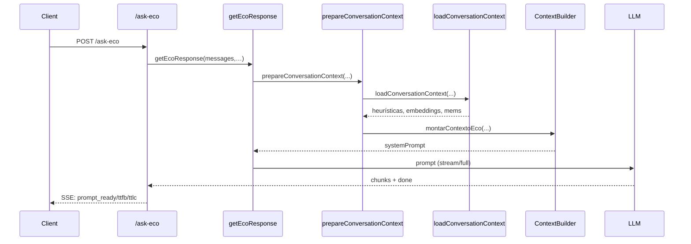
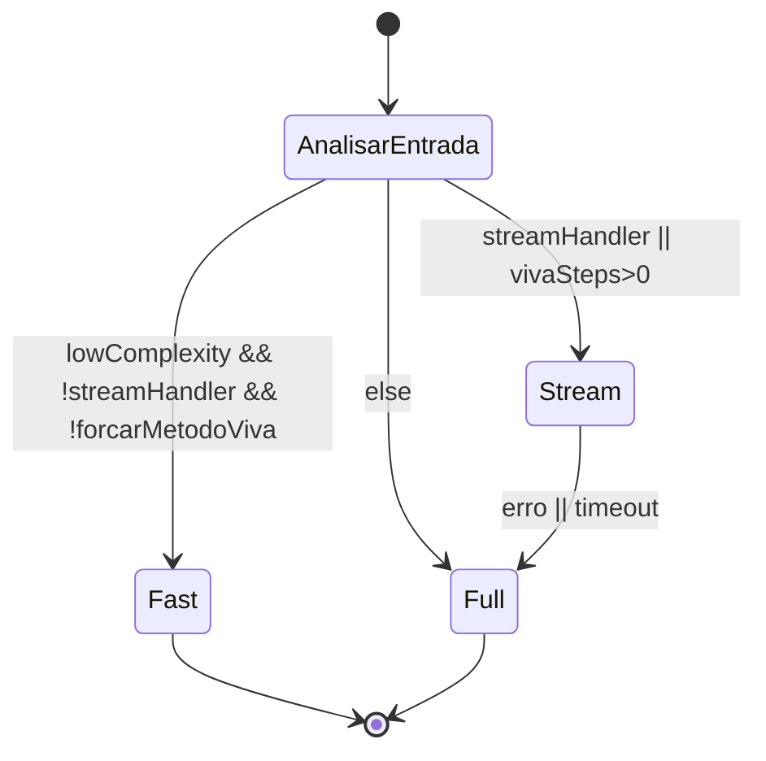

# Fluxo Conversacional Eco

## Visão geral
O pipeline "Eco" transforma requisições `POST /ask-eco` em respostas com SSE opcional ou fallback síncrono. `getEcoResponse` coordena roteamento, montagem de prompt e execução do LLM, enquanto `ActivationTracer` registra cache, heurísticas, módulos, latências e erros acessíveis via `GET /debug/trace/:id`.

A camada de contexto combina sinais imediatos, memórias e heurísticas derivadas de embeddings. `prepareConversationContext`, `loadConversationContext`, `ContextCache.build` e `ContextBuilder.montarContextoEco` empilham módulos reutilizáveis e reciclam caches quando o cenário se repete.

## Papel do orquestrador e do contexto
`getEcoResponse` valida entrada, dispara atalhos (`handlePreLLMShortcuts`), calcula decisão emocional (`computeEcoDecision`), roteia (`defaultConversationRouter.decide`), prepara contexto e chama o modelo via `executeStreamingLLM` ou `executeFullLLM`. A camada de contexto injeta mensagem atual/histórico, memórias e heurísticas de `loadConversationContext`, flags (`vivaSteps`, `forcarMetodoViva`, `lowComplexity`) para guiar `ContextBuilder.montarContextoEco` e metadados (nome, abertura híbrida, bloco técnico) consumidos pelo `defaultResponseFinalizer`.

## Decisão fast/stream/full e memória
- `defaultConversationRouter.decide` usa intensidade/abertura (`computeEcoDecision`), presença de `promptOverride`, saudação breve e histórico com assistente. Quando `lowComplexity` é verdadeiro, `vivaAtivo` é falso e não existe handler de stream, a rota `fast` é escolhida e delega para `runFastLaneLLM`.
- Se o cliente envia `stream`, `executeStreamingLLM` conduz o fluxo, emitindo eventos `prompt_ready`, `first_token`, `chunk` e `done`. Sem handler, `executeFullLLM` retorna uma resposta única.
- `computeEcoDecision` define `saveMemory` para intensidade ≥ 7. A decisão é registrada via `ActivationTracer.setMemoryDecision` e respeitada pelo `defaultResponseFinalizer`, que agenda `salvarMemoriaViaRPC` apenas quando o sinal é verdadeiro.

## Como a requisição vira resposta
1. Cliente chama `POST /ask-eco` com `messages`, identidade (`userId`/`guestId`) e flags (`stream`, `promptReadyImmediate`, `forcarMetodoViva`).
2. O endpoint cria `ActivationTracer`, devolve `X-Eco-Trace-Id`, valida credenciais/limites e grava falhas com `addError`.
3. Calcula chave para `RESPONSE_CACHE`; hits emitem `cache: true` com `markCache("hit")`, misses seguem com `markCache("miss")`.
4. `handlePreLLMShortcuts` pode responder de imediato; se ocorrer, o tracer recebe `markPromptReady` e `markTotal` e o fluxo encerra.
5. `computeEcoDecision` mede intensidade, abertura e `vivaSteps`. `defaultConversationRouter.decide` define modo (`fast`/`full`), `vivaAtivo`, `lowComplexity` e `forceFull`.
6. Se `mode === "fast"` e não há handler, `runFastLaneLLM` gera resposta curta e finaliza.
7. `prepareConversationContext` chama `loadConversationContext` (heurísticas, memórias, embeddings) e dispara `addHeuristic`, `setEmbeddingResult` ou `addError`.
8. `defaultContextCache.build` tenta reaproveitar o prompt; hits adicionam `__context_cache`, misses invocam `ContextBuilder.montarContextoEco`, que aplica heurísticas, orçamento (`Budgeter`) e chama `addModule`.
9. `buildFullPrompt` costura `systemPrompt`, histórico recente e `maxTokens`.
10. `executeStreamingLLM` ou `executeFullLLM` envia o prompt ao `principalModel`, ajusta `setModel` e emite `prompt_ready`, `first_token`, `done` (stream) ou resposta única.
11. `defaultResponseFinalizer` limpa texto, monta bloco técnico, decide persistência (`salvarMemoriaViaRPC`) e devolve campos essenciais.
12. O endpoint entrega chunks ou JSON final, salva cache quando `cacheable`, inclui `trace` em `done` se `?debug=1`, chama `markTotal` e persiste o traço via `saveActivationTrace`.

### Marcos do ActivationTracer
| Etapa | Método | Disparo |
| --- | --- | --- |
| Cache de resposta | `markCache("hit"/"miss")` | Antes de usar ou montar prompt |
| Heurísticas | `addHeuristic` | Durante `loadConversationContext` |
| Módulos | `addModule` | Em `ContextBuilder.montarContextoEco` e hits do `ContextCache` |
| Embeddings | `setEmbeddingResult` | Após medir similaridade |
| Prompt pronto | `markPromptReady` | Ao concluir prompt ou receber `prompt_ready` |
| Primeiro token | `markFirstToken` | Primeiro chunk SSE ou resposta síncrona |
| Latência total | `markTotal` | Evento `done` ou fallback |
| Memória | `setMemoryDecision` | Saída de `computeEcoDecision` |
| Erros | `addError` | Falhas de validação, auth, stream ou cache |

## Diagrama de sequência


## Matriz de decisão de modo


### Condições de transição
| Condição | Ação |
| --- | --- |
| `forcarMetodoViva` | Mantém `vivaAtivo`, impede fast |
| `vivaSteps.length > 0` | Prioriza fluxo VIVA (stream/full) |
| `lowComplexity` && `nivelRoteador ≤ 1` | Permite fast quando não há handler |
| Saudação breve | Seleciona módulos mínimos |
| `fallback` por erro/timeout | Emite `STREAM_TIMEOUT_MESSAGE`, desabilita cache |

## Montagem de contexto
- `loadConversationContext` agrega heurísticas, memórias e embeddings em paralelo, usa caches/timeouts e, quando vazio, devolve placeholders (`MEMORIAS_RELEVANTES`) registrando falhas via `addError`.
- `ContextCache.build` gera chave `ctx:<userId>:<nivel>:<intensidade arredondada>:ms<count>:v<flag>:d<flag>:a<flag>:h<flag>:e<flag>`; hits devolvem prompt base marcando `__context_cache` como `cached`, misses invocam `ContextBuilder.montarContextoEco`, que aplica heurísticas, orçamento (`Budgeter`) e chama `addModule` com motivo.

### Regras rápidas
| Sinal | Impacto |
| --- | --- |
| `vivaSteps` | Injeta sequência VIVA e instruções terapêuticas |
| `aberturaHibrida.sugestaoNivel` | Ajusta tom e instruções extras |
| `forcarMetodoViva` | Mantém blocos técnicos mesmo em baixa intensidade |
| `blocoTecnicoForcado` | Sobrescreve bloco calculado pelo finalizador |

## Pseudo-código do pipeline
```text
function askEco(req):
  tracer = new ActivationTracer()
  if RESPONSE_CACHE.hit(key): return emitCached(tracer)
  decision = computeEcoDecision(ultimaMsg)
  tracer.setMemoryDecision(decision.saveMemory, decision.intensity, reason)
  route = defaultConversationRouter.decide(thread, ultimaMsg, decision)
  if route.mode == "fast" && !req.stream: return runFastLaneLLM()
  ctx = prepareConversationContext({ ...req, decision, activationTracer: tracer })
  prompt = buildFullPrompt({ decision: route, systemPrompt: ctx.systemPrompt, messages: thread })
  tracer.markPromptReady()
  result = req.stream ? executeStreamingLLM(...) : executeFullLLM(...)
  final = defaultResponseFinalizer(result, decision)
  if decision.saveMemory: salvarMemoriaViaRPC(final.memoria)
  cacheIfEligible(final)
  tracer.markTotal()
  return final.response
```

## Contratos de dados
- **Entrada (`POST /ask-eco`)**: `messages[]` (`{id?, role, content}`), `userId` ou `guestId` + `isGuest`, flags (`stream`, `promptReadyImmediate`, `forcarMetodoViva`), `sessionMeta`, `promptOverride`, `metaFromBuilder`.
- **Saída (`GetEcoResult` / SSE)**: `message`, `modelo`, `intensidade`, `resumo`, `tags`, `categoria`, `emocao`, `usage`, eventos `prompt_ready`, `first_token`, `chunk`, `latency`, `done`, `meta_pending`, `reconnect`; `EcoStreamingResult.finalize()` fecha pós-processamento.
- **Debug (`GET /debug/trace/:id`)**: snapshot com `traceId`, `userId`, `model`, `cacheStatus`, `heuristics[]`, `modules[]`, `embeddingResult`, `memoryDecision`, `latency` (`promptReadyMs`, `firstTokenMs`, `totalMs`), `errors[]`, `startedAt`, `finishedAt`.

## Observabilidade e debug
- Marcas: `markCache`, `addHeuristic`, `addModule`, `setEmbeddingResult`, `markPromptReady`, `markFirstToken`, `markTotal`, `setMemoryDecision`, `addError`.
- Depuração: `?debug=1` inclui `trace` em `done`; `X-Eco-Trace-Id` identifica a sessão (condicionado a `requireAdmin`).

## Erros e timeouts
- Guardas de tempo no streaming enviam `STREAM_TIMEOUT_MESSAGE` com `fallback: true`, chamam `markTotal` e desabilitam cache.
- Erros de autenticação ou validação encerram antes do LLM e registram `addError("auth"|"validation")`.
- Falhas durante o stream (`event.type === "error"`) viram fallback (`meta.reason = "error"`) e bloqueiam cache/persistência.

## Flags e comportamento
- `promptReadyImmediate`: antecipa `prompt_ready`.
- `stream`: habilita `executeStreamingLLM`; ausência usa full/fast.
- `isGuest`/`guestId`: limita interações e gera `addError("rate_limit")` quando excedido.
- `requireAdmin`: controla acesso ao debug.
- `computeEcoDecision`: ajusta persistência de memória.

## Glossário
- **Heurística**: regra derivada de sinais/embeddings usada para ativar módulos.
- **Módulo**: bloco textual reutilizável costurado pelo builder.
- **Memória semelhante**: registro recuperado por embeddings para `MEMORIAS_RELEVANTES`.
- **Transição de estado**: mudança entre modos `fast`, `stream`, `full`.
- **SSE**: canal para `prompt_ready`, chunks e métricas (TTFB/TTLC).

## Instrumentação adicional sugerida
- Marcar hits/misses do `ContextCache` com `markCache` para diferenciá-los de módulos.
- Registrar `setEmbeddingResult` distinto para embeddings aquecidas (`getEmbeddingCached`) e conversacionais, e emitir `addError` quando o write-back do `RESPONSE_CACHE` falhar.

## Checks rápidos (curl)
1. Streaming: `curl -N -X POST https://<host>/ask-eco -H 'Content-Type: application/json' -d '{"userId":"u1","messages":[{"role":"user","content":"Preciso de apoio"}]}'`.
2. Cache hit: repita a chamada e observe `cache: true` em `done`.
3. Auth inválida: `curl -X POST https://<host>/ask-eco -H 'Content-Type: application/json' -d '{"messages":[]}'` gera `addError("validation")`.

