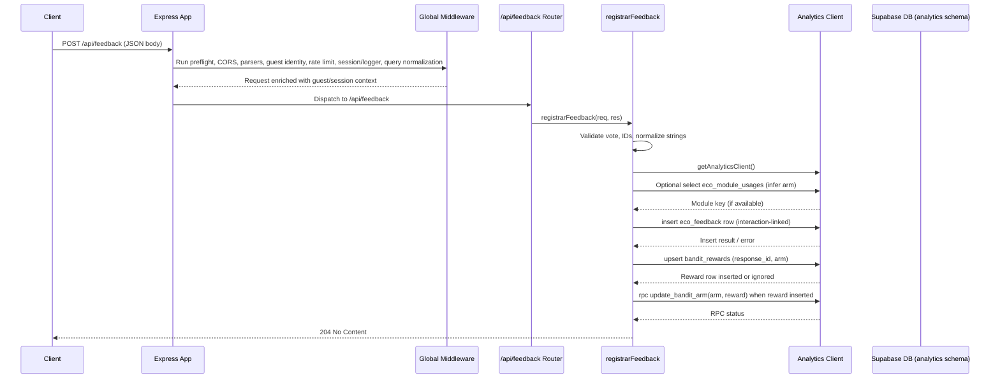

# Feedback Request Flow

This document describes how a feedback signal travels from an external client to the Supabase `analytics` schema when calling `POST /api/feedback`.

## Components in the path

- **Client** – Sends an authenticated JSON payload to `/api/feedback`.
- **Express app** – Bootstrapped by `createApp()`; responsible for the global middleware pipeline, route mounting, and error handling before the request reaches the controller.
- **Global middleware** – Preflight + CORS handlers, JSON/urlencoded parsers, guest identity propagation, rate limiting, guest session enrichment, logging, and query normalization.
- **Feedback router** – Maps the root route `/` under the `/api/feedback` prefix to the feedback controller.
- **Feedback controller** – Validates the payload, persists votes into `analytics.eco_feedback`, upserts bandit rewards, and triggers the `update_bandit_arm` RPC.
- **Supabase analytics client** – Singleton client instantiated with the service-role key and pinned to the `analytics` schema.
- **Supabase database** – Stores the feedback row, reward record, and updates bandit arm statistics.

## Mermaid sequence diagram

## Step-by-step walkthrough

1. **Express entry and middleware chain.** `createApp()` sets up preflight handling, CORS, JSON/urlencoded parsers, guest identity propagation, API rate limiting, guest session enrichment, logging, and query normalization before routing any `/api/feedback` call. These middleware add headers, normalize the request, and block abusive clients before controller code executes.
2. **Route dispatch.** After middleware, Express forwards the request to the router mounted at `/api/feedback`, whose lone `POST /` handler is `registrarFeedback`.
3. **Payload validation and normalization.** The controller trims payload fields, enforces `vote` to be either `up` or `down`, requires either `response_id` or `interaction_id`, normalizes optional text, and infers the response identifier fallback.
4. **Module arm inference.** When the payload omits the `arm`, the controller queries `analytics.eco_module_usages` for the earliest module linked to the given interaction to infer the bandit arm. Fallbacks default to `baseline`.
5. **Feedback persistence.** If an `interaction_id` is provided, the controller inserts a row into `analytics.eco_feedback`, attaching metadata with the inferred pillar and arm. Foreign-key violations return `400` (unknown interaction); other errors are logged.
6. **Bandit reward upsert.** Independently of `interaction_id`, the controller upserts into `analytics.bandit_rewards` to register the reward signal, ignoring duplicates based on `(response_id, arm)`.
7. **Bandit arm update RPC.** When the reward upsert inserts a new row, the controller invokes the `update_bandit_arm` RPC so the database can recompute Thompson Sampling priors for the affected arm.
8. **Response emission.** Successful flows respond with `204 No Content`; validation failures or persistence errors return appropriate HTTP codes.

## Key source references

- Global middleware pipeline and router mounting in `createApp()`. 【F:server/core/http/app.ts†L63-L165】
- Feedback route wiring the controller under `/api/feedback`. 【F:server/routes/feedbackRoutes.ts†L1-L8】
- Controller logic for validation, Supabase interactions, and RPC invocation. 【F:server/controllers/feedbackController.ts†L1-L205】
- Service-role Supabase analytics client configuration. 【F:server/services/supabaseClient.ts†L1-L46】
