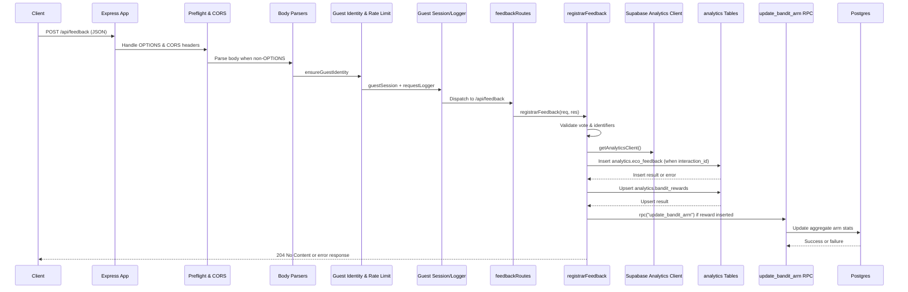

# Feedback Request Flow

This document describes how a `POST /api/feedback` request travels from the client through the Express backend until the Supabase Postgres database is updated. The goal is to help engineers reason about middleware order, controller responsibilities, and the tables affected when explicit feedback is recorded.

## Components

- **Client** – Issues HTTPS requests with JSON payloads and optional headers `Authorization`, `X-Eco-Guest-Id`, and `X-Eco-Session-Id`.
- **Express application** – Created via `createApp()` and responsible for wiring middlewares, health checks, and all `/api` routers. 【F:server/core/http/app.ts†L94-L176】
- **Preflight & CORS middlewares** – Handle `OPTIONS` requests and apply `Access-Control-*` headers before other logic runs. 【F:server/core/http/app.ts†L106-L129】
- **Body parsers** – Deserialize JSON and URL-encoded payloads (skipped for `OPTIONS`). 【F:server/core/http/app.ts†L131-L134】
- **Guest identity & rate limiting** – `ensureGuestIdentity` assigns persistent guest/session identifiers, while `apiRateLimiter` enforces per-token/guest/IP quotas. 【F:server/core/http/app.ts†L136-L150】【F:server/core/http/guestIdentity.ts†L69-L138】
- **Guest session middleware** – Activates guest-mode limits and mirrors guest metadata in `req.guest`. 【F:server/core/http/app.ts†L152-L156】【F:server/core/http/middlewares/guestSession.ts†L81-L162】
- **Request logger & query normalizer** – Attach structured logs and harmonize query params before routing. 【F:server/core/http/app.ts†L152-L158】【F:server/core/http/middlewares/logger.ts†L5-L18】【F:server/core/http/middlewares/queryNormalizer.ts†L1-L6】
- **Feedback router** – Mounts `POST /api/feedback` and delegates to `registrarFeedback`. 【F:server/core/http/app.ts†L162-L170】【F:server/routes/feedbackRoutes.ts†L1-L8】
- **Feedback controller** – Validates payloads, infers missing metadata, writes to Supabase tables, and triggers the bandit RPC. 【F:server/controllers/feedbackController.ts†L1-L201】
- **Supabase analytics client** – Service-role connection scoped to the `analytics` schema, reused across requests. 【F:server/services/supabaseClient.ts†L1-L52】
- **Database artifacts** – Tables `analytics.eco_feedback`, `analytics.bandit_rewards`, and RPC `update_bandit_arm` that persist feedback and adjust bandit arm statistics. 【F:server/controllers/feedbackController.ts†L89-L198】

## Sequence overview

## Detailed flow

1. **Client submission.** A client sends `POST /api/feedback` with a JSON body describing the vote and optional metadata. Guest/session identifiers are propagated via headers or cookies so the backend can associate rate limits. 【F:README.md†L28-L69】【F:server/core/http/guestIdentity.ts†L69-L138】
2. **Express entry & CORS.** The request hits `createApp()`, which first executes the manual preflight handler and the CORS middleware. `OPTIONS` calls terminate here; other verbs inherit the configured headers before continuing. 【F:server/core/http/app.ts†L104-L129】
3. **Body parsing.** JSON and URL-encoded parsers populate `req.body` to expose the feedback payload to downstream handlers. 【F:server/core/http/app.ts†L131-L134】
4. **Identity & throttling.** `ensureGuestIdentity` ensures both guest and session IDs exist, mirroring them back in the response headers, while `apiRateLimiter` stops bursts per JWT/guest/IP. 【F:server/core/http/app.ts†L136-L150】【F:server/core/http/guestIdentity.ts†L69-L138】
5. **Guest session enrichment.** Requests flagged with `X-Guest-Mode` load the guest session middleware, which enforces guest-specific rate limits and attaches metadata to `req.guest`. 【F:server/core/http/app.ts†L152-L156】【F:server/core/http/middlewares/guestSession.ts†L81-L162】
6. **Logging & query normalization.** `requestLogger` records structured HTTP logs once the response finishes, and `normalizeQuery` harmonizes query aliases before router dispatch. 【F:server/core/http/app.ts†L152-L158】【F:server/core/http/middlewares/logger.ts†L5-L18】【F:server/core/http/middlewares/queryNormalizer.ts†L1-L6】
7. **Router selection.** The shared `/api` prefix forwards the call to `feedbackRoutes`, which simply invokes `registrarFeedback`. 【F:server/core/http/app.ts†L162-L170】【F:server/routes/feedbackRoutes.ts†L1-L8】
8. **Payload validation.** The controller ensures the `vote` is `"up"` or `"down"`, normalizes IDs/reasons, and checks that either `interaction_id` or `response_id` exists. Errors yield `400` responses with logged context. 【F:server/controllers/feedbackController.ts†L19-L74】
9. **Arm inference.** When `arm` is missing, the controller queries `analytics.eco_module_usages` for the earliest module tied to the interaction, falling back to `baseline`. 【F:server/controllers/feedbackController.ts†L49-L88】
10. **Primary persistence.** If an `interaction_id` is present, the handler inserts a row into `analytics.eco_feedback`, tagging metadata such as pillar, arm, guest ID, and reason. Foreign-key violations return `400`; other errors surface as `500`. 【F:server/controllers/feedbackController.ts†L89-L138】
11. **Bandit reward write.** The controller upserts the reward into `analytics.bandit_rewards`, recording a single reward per `(response_id, arm)` pair. Duplicate upserts are logged but treated as success. 【F:server/controllers/feedbackController.ts†L140-L172】
12. **Bandit arm update.** When the reward table reports a newly inserted row, the handler invokes `rpc("update_bandit_arm", ...)`, letting Supabase adjust aggregated statistics for the arm. Failures at this stage result in `500` responses. 【F:server/controllers/feedbackController.ts†L172-L198】
13. **Response.** On success the controller logs the applied reward and returns `204 No Content`. All responses inherit the CORS headers applied earlier in the pipeline. 【F:server/controllers/feedbackController.ts†L198-L201】【F:server/core/http/app.ts†L104-L170】

## Error handling & observability

- Structured logs (`http.request`, `feedback.persist_*`, `feedback.bandit_*`) provide breadcrumbs correlating guest IDs, interactions, and database errors. 【F:server/core/http/middlewares/logger.ts†L5-L18】【F:server/controllers/feedbackController.ts†L31-L201】
- Any middleware or controller error bubbles to the Express error handler, which adds CORS headers and returns a `500` JSON payload after logging the stack. 【F:server/core/http/app.ts†L177-L198】
- The analytics Supabase client is initialized at boot using service-role credentials; missing environment variables are logged and disable persistence until resolved. 【F:server/services/supabaseClient.ts†L7-L52】
