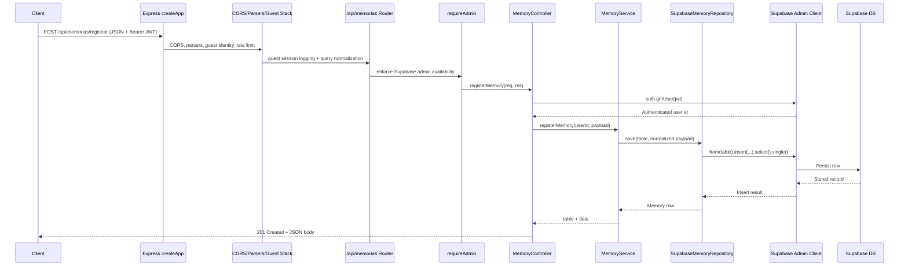

# Client-to-Database Request Flow

This document explains how a client request travels through the Eco backend until it reaches Supabase storage, using the memory registration endpoint (`POST /api/memorias/registrar`) as the canonical example. The same infrastructure (Express app, middleware layers, controllers, services, and repositories) applies to other domain endpoints as well.

## High-level architecture

1. **Express entrypoint.** `createApp()` configures global middleware for CORS, JSON parsing, guest identity propagation, rate limiting, guest session logging, and query normalization before attaching API routers.【F:server/core/http/app.ts†L105-L138】
2. **Route mounting.** The memory router is mounted under multiple prefixes (`/api/memorias`, `/api/memories`, aliases without `/api`) so legacy and new clients share the same handlers.【F:server/core/http/app.ts†L216-L244】
3. **Supabase guard.** Every memory route passes through `requireAdmin`, which ensures the Supabase service-role client is configured and short-circuits with HTTP 500 if env vars are missing.【F:server/domains/memory/routes.ts†L1-L16】【F:server/mw/requireAdmin.ts†L14-L30】
4. **Controller orchestration.** `MemoryController.registerMemory` authenticates the caller via `supabase.auth.getUser`, validates the payload, and delegates to the domain service.【F:server/domains/memory/controller.ts†L78-L176】
5. **Domain logic.** `MemoryService.registerMemory` normalizes tags, generates summaries/embeddings, chooses the target table (`memories` vs. `referencias_temporarias`), and builds the insert payload.【F:server/domains/memory/service.ts†L62-L123】
6. **Repository persistence.** `SupabaseMemoryRepository.save` inserts the payload through the Supabase admin client, surfacing errors when inserts fail.【F:server/adapters/supabaseMemoryRepository.ts†L47-L193】
7. **Supabase configuration.** The admin client comes from `ensureSupabaseConfigured`, which verifies the service-role URL and key before lazily caching the client.【F:server/lib/supabaseAdmin.ts†L1-L62】

## Sequence diagram

## Step-by-step flow

1. **Request arrives.** The Express app handles global CORS/OPTIONS, parses JSON, establishes/propagates guest identifiers, enforces a token/guest/IP rate limit, logs the request, and normalizes query strings before routing.【F:server/core/http/app.ts†L111-L138】
2. **Route dispatch.** Once the `/api/memorias` router matches, `requireAdmin` injects the Supabase admin client on the request (or returns a 500 if configuration is missing).【F:server/domains/memory/routes.ts†L5-L12】【F:server/mw/requireAdmin.ts†L14-L30】
3. **Authentication.** `MemoryController.registerMemory` extracts the bearer token, resolves the Supabase user with `auth.getUser`, and rejects unauthenticated callers with HTTP 401.【F:server/domains/memory/controller.ts†L95-L152】
4. **Domain preparation.** The controller forwards the payload to `MemoryService.registerMemory`, which clamps intensity, optionally auto-tags via AI, generates Eco summaries, computes embeddings, and decides which table should receive the record.【F:server/domains/memory/service.ts†L65-L118】
5. **Database insert.** The service asks `SupabaseMemoryRepository.save` to persist the payload. The repository calls `insertMemory`, which performs a Supabase `insert(...).select().single()` and throws detailed errors on failure.【F:server/domains/memory/service.ts†L121-L124】【F:server/adapters/supabaseMemoryRepository.ts†L47-L133】
6. **Success response.** The persisted row and chosen table flow back through the service and controller; the controller responds with `201 Created` containing `{ success: true, table, data }`.【F:server/domains/memory/controller.ts†L167-L170】

## Supabase client lifecycle

- `requireAdmin` and the repository both call `ensureSupabaseConfigured`, which lazily instantiates the Supabase service-role client and caches it for subsequent requests.【F:server/mw/requireAdmin.ts†L14-L30】【F:server/adapters/supabaseMemoryRepository.ts†L47-L67】【F:server/lib/supabaseAdmin.ts†L12-L24】
- If `SUPABASE_URL` or `SUPABASE_SERVICE_ROLE_KEY` are missing, `SupabaseConfigError` propagates context to HTTP 500 responses so operators can diagnose configuration issues quickly.【F:server/lib/supabaseAdmin.ts†L12-L23】【F:server/mw/requireAdmin.ts†L14-L30】

This flow ensures every client request passes through consistent cross-cutting middleware, enforces authentication before domain logic runs, centralizes memory-specific enrichment in the service layer, and persists data through a single Supabase integration point.
