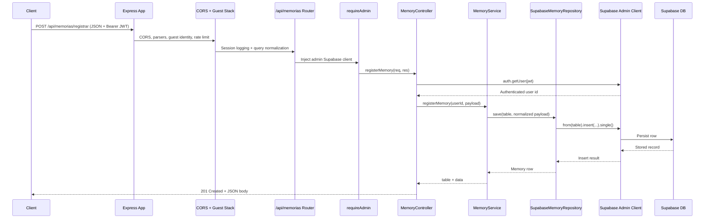

# Memory Request Flow

This document traces the end-to-end flow for a client request that stores a memory via `POST /api/memorias/registrar`, covering how the Express server, middleware stack, controller, domain service, and Supabase integrations cooperate to persist data in the database.

## Components involved

- **Client** – Any HTTP caller (web app, mobile app) that sends authenticated JSON payloads.
- **Express app** – Created via `createApp()` and responsible for CORS setup, parsers, guest identity, rate limiting, guest session logging, query normalization, and router registration.【F:server/core/http/app.ts†L105-L270】
- **Memory router** – Mounts `/registrar` under `/api/memorias`, injects the Supabase admin client with `requireAdmin`, and wires controller handlers.【F:server/domains/memory/routes.ts†L1-L18】【F:server/mw/requireAdmin.ts†L1-L28】
- **Memory controller** – Validates the caller via `supabase.auth.getUser`, parses the request body, and orchestrates the domain service to persist data.【F:server/domains/memory/controller.ts†L78-L239】
- **Memory service** – Normalizes payload fields, computes embeddings/tags, chooses the destination table, and delegates persistence to the repository.【F:server/domains/memory/service.ts†L62-L137】
- **Supabase memory repository** – Uses the admin client to insert into `memories`/`referencias_temporarias`, query existing rows, and surface Supabase errors with context.【F:server/adapters/supabaseMemoryRepository.ts†L47-L205】
- **Supabase admin client** – Lazily instantiated service-role client shared across middleware and repository calls.【F:server/lib/supabaseAdmin.ts†L12-L62】
- **Database** – Stores the memory row and returns the persisted representation through Supabase SQL endpoints.

## High-level sequence



## Middleware pipeline overview

```mermaid
flowchart TD
    A[Client Request<br/>POST /api/memorias/registrar] --> B[Express createApp]
    B --> C[CORS middleware<br/>handles OPTIONS and CORS headers]
    C --> D[Body parsers<br/>JSON & urlencoded]
    D --> E[ensureGuestIdentity]
    E --> F[Rate limiter<br/>auth/guest/IP buckets]
    F --> G[Guest session middleware<br/>+ request logger]
    G --> H[normalizeQuery middleware]
    H --> I[/api router switch]
    I --> J[memoryRoutes /registrar]
    J --> K[requireAdmin middleware]
    K --> L[MemoryController.registerMemory]
    L --> M[MemoryService.registerMemory]
    M --> N[SupabaseMemoryRepository.save]
    N --> O[Supabase admin client insert]
    O --> P[Supabase database persistence]
    P --> Q[Controller returns payload]
    Q --> R[HTTP response to client]
```

## Detailed flow description

1. **Client request.** A front end issues a `POST /api/memorias/registrar` request containing the memory payload and a `Bearer` token in the `Authorization` header.
2. **Express entry.** `createApp()` receives the request and immediately runs the CORS middleware (including OPTIONS short-circuit), JSON/urlencoded parsers, guest identity propagation, rate limiting, guest session enrichment, logging, and query normalization before handing control to the router tree.【F:server/core/http/app.ts†L105-L198】
3. **Router dispatch.** The `/api/memorias` router attaches `requireAdmin`, guaranteeing that Supabase configuration exists before the controller executes; misconfiguration yields a 500 response with diagnostic details.【F:server/domains/memory/routes.ts†L5-L16】【F:server/mw/requireAdmin.ts†L13-L27】
4. **Controller authentication.** `MemoryController.registerMemory` extracts the bearer token, calls `supabase.auth.getUser`, and rejects unauthenticated requests with HTTP 401.【F:server/domains/memory/controller.ts†L95-L177】
5. **Domain preparation.** The controller forwards the validated user id and request body to `MemoryService.registerMemory`, which clamps intensity, derives auto-tags/embeddings, computes the Eco summary, decides between `memories` and `referencias_temporarias`, and builds the insert payload.【F:server/domains/memory/service.ts†L62-L123】
6. **Persistence.** `MemoryService` invokes the `SupabaseMemoryRepository.save` method, which performs an `insert(...).select().single()` call via the admin client and bubbles structured Supabase errors when present.【F:server/domains/memory/service.ts†L121-L124】【F:server/adapters/supabaseMemoryRepository.ts†L47-L133】
7. **Database write.** Supabase persists the row and returns the inserted record, which flows back through the repository and service to the controller. The controller returns `201 Created` with the table name and stored data.【F:server/adapters/supabaseMemoryRepository.ts†L47-L67】【F:server/domains/memory/controller.ts†L151-L170】
8. **Error handling.** Any Supabase configuration issue, auth failure, validation error, or repository exception results in early responses (500/401/400) or logs for operational visibility.【F:server/mw/requireAdmin.ts†L13-L27】【F:server/domains/memory/controller.ts†L145-L176】【F:server/adapters/supabaseMemoryRepository.ts†L108-L187】

## Supabase data shaping

Before the insert is executed, the service normalizes tags, derives embeddings, and composes the Eco summary string written into the database. This step centralizes domain-specific transformations so that controllers remain thin:

- `normalizeTags` accepts either string or array input and ensures an array of trimmed tags.【F:server/domains/memory/service.ts†L34-L41】
- Tags are auto-generated via `gerarTagsAutomaticasViaIA` if the caller omits them, and embeddings are produced/normalized with `embedTextoCompleto` and `unitNorm` for both semantic and emotional vectors.【F:server/domains/memory/service.ts†L71-L119】
- The resulting payload mirrors the Supabase table schema and keeps nullability consistent for optional fields (e.g., `mensagem_id`, `analise_resumo`).【F:server/domains/memory/service.ts†L97-L119】

## Repository read path (overview)

While this document focuses on the write flow, the same repository exposes a `list` method that selects curated columns, applies tag filters, and normalizes heterogeneous Supabase payload types (string vs. array intensity/tags) before returning rows to the controller. That ensures the API consistently delivers typed objects regardless of how data is stored or retrieved.【F:server/adapters/supabaseMemoryRepository.ts†L69-L205】【F:server/domains/memory/service.ts†L126-L136】【F:server/domains/memory/controller.ts†L179-L239】
