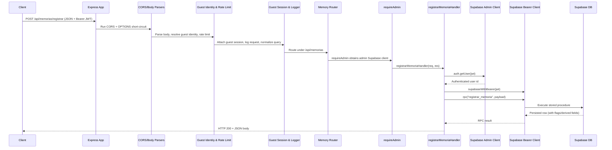

# Memory Request Flow

This document traces the end-to-end flow for a client request that stores a memory via `POST /api/memorias/registrar`, covering
how the Express server, middleware stack, controller, and Supabase integrations cooperate to persist data in the database.

## Components involved

- **Client** – Any HTTP caller (web app, mobile app) that sends authenticated JSON payloads.
- **Express app** – Created via `createApp()` and responsible for global middleware and route registration.
- **Global middleware** – CORS handling, body parsers, guest identity, rate limiting, guest session enrichment, logging, and query normalization.
- **Memory router** – Mounts `/registrar` and applies the `requireAdmin` middleware before the controller.
- **`requireAdmin` middleware** – Ensures a Supabase service-role client is available for downstream handlers.
- **Memory controller** – Authenticates the user, constructs a user-scoped Supabase client, and invokes the database RPC.
- **Supabase clients** – The admin client validates the JWT and a bearer-scoped client executes the RPC.
- **Supabase Edge Function / RPC** – `registrar_memoria` encapsulates persistence logic in the database.
- **Database** – Stores the memory row and returns the persisted representation.

## High-level sequence



## Middleware pipeline overview

```mermaid
flowchart TD
    A[Client Request<br/>POST /api/memorias/registrar] --> B[Express createApp]
    B --> C[CORS middleware<br/>handles OPTIONS and CORS headers]
    C --> D[Body parsers<br/>JSON & urlencoded]
    D --> E[ensureGuestIdentity]
    E --> F[Rate limiter<br/>auth/guest/IP buckets]
    F --> G[Guest session middleware<br/>+ request logger]
    G --> H[normalizeQuery middleware]
    H --> I[/api router switch]
    I --> J[memoryRoutes /registrar]
    J --> K[requireAdmin middleware]
    K --> L[registrarMemoriaHandler]
    L --> M[supabase.auth.getUser(token)]
    M --> N[supabaseWithBearer(token)]
    N --> O[RPC registrar_memoria]
    O --> P[Supabase database persistence]
    P --> Q[Controller formats response]
    Q --> R[HTTP response to client]
```

## Detailed flow description

1. **Client request.** A front end issues a `POST /api/memorias/registrar` request containing the memory payload and a `Bearer`
   token in the `Authorization` header.
2. **Express entry.** `createApp()` receives the request and immediately runs the CORS middleware, which can terminate OPTIONS
   preflight requests and applies the configured CORS headers.
3. **Body parsing.** Express JSON and URL-encoded parsers deserialize the request body (skipped for OPTIONS requests).
4. **Guest identity and rate limiting.** `ensureGuestIdentity` ensures every call carries a guest identifier, followed by a
   token/IP-based rate limiter that throttles abusive usage while skipping excluded paths.
5. **Session enrichment and logging.** The guest session middleware loads session metadata, `requestLogger` records request
   diagnostics, and `normalizeQuery` coerces query parameters into normalized shapes.
6. **Router dispatch.** After shared middleware, Express forwards the request to the `/api/memorias` router that defines
   memory-related endpoints.
7. **Admin client injection.** `requireAdmin` ensures Supabase admin credentials exist, attaching the service-role client to the
   request and short-circuiting with a 500 error when configuration is missing.
8. **Controller authentication.** `registrarMemoriaHandler` validates the `Authorization` header, extracts the JWT, and
   authenticates the token via `supabase.auth.getUser` using the admin client.
9. **Payload validation.** The controller checks required fields (e.g., numeric `intensidade`) before proceeding.
10. **Bearer-scoped Supabase client.** With the validated JWT, `supabaseWithBearer` instantiates a Supabase client that
    forwards the bearer token in all requests.
11. **RPC execution.** The controller calls `rpc("registrar_memoria", ...)` with the sanitized payload, delegating domain rules
    and persistence to the database layer.
12. **Database persistence.** Supabase executes the `registrar_memoria` stored procedure, inserting or updating rows and
    returning the resulting record, including derived flags such as `primeira`.
13. **Response shaping.** The controller normalizes the RPC response, maps fields into the public memory schema, and returns an
    HTTP 200 JSON payload indicating whether the memory was the user's first significant entry.
14. **Error handling.** Any errors along the path result in early HTTP responses: authentication errors return 401, validation
    issues return 400, configuration problems return 500, and uncaught errors bubble to the global error handler.
