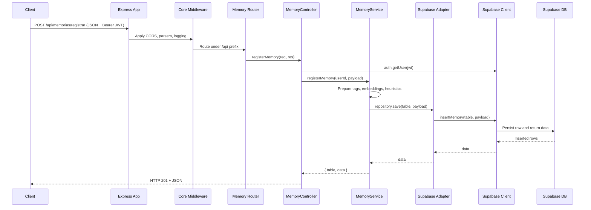

# Memory Request Flow

This document traces the end-to-end flow for a client request that stores a memory via `POST /api/memorias/registrar`, covering the hop-by-hop responsibilities from the HTTP layer to the Supabase database.

## High-level sequence

## Detailed flow description

1. **Client request.** A front end issues a `POST /api/memorias/registrar` request containing the memory payload and a `Bearer` token in the `Authorization` header.
2. **Express app bootstrap.** The Express application created in `createApp()` enables trust proxy, applies CORS early, configures universal `OPTIONS` handling, registers SSE-specific headers, attaches JSON/urlencoded parsers, logging, and query normalisation, then mounts the memory routes under the `/api` prefix.【F:server/core/http/app.ts†L17-L74】
3. **Route dispatch.** The memory router binds `POST /registrar` to the `registerMemory` handler of the `MemoryController`, which Express resolves when the request path matches `/api/memorias/registrar`.【F:server/domains/memory/routes.ts†L1-L14】
4. **Authentication.** The controller extracts the bearer token and calls `supabase.auth.getUser(token)` to validate the session. Missing or invalid tokens short-circuit with a `401 Unauthorized` response.【F:server/domains/memory/controller.ts†L26-L49】
5. **Controller validation and delegation.** After parsing and validating the payload (ensuring `texto` and `intensidade` exist), the controller forwards the user id and request data to the `MemoryService.registerMemory` method. Errors are logged and surfaced as `500` responses.【F:server/domains/memory/controller.ts†L51-L109】
6. **Service orchestration.** The `MemoryService` clamps the intensity, determines whether to persist in the permanent `memories` table or the temporary `referencias_temporarias` table, normalises tags (auto-generating them if empty), computes embeddings, estimates openness, and assembles the Supabase payload before delegating to the repository.【F:server/domains/memory/service.ts†L41-L116】
7. **Repository abstraction.** The domain repository is a thin wrapper that forwards the insert call to the Supabase adapter, enforcing repository-level typing between the service and the data layer.【F:server/domains/memory/repository.ts†L1-L12】
8. **Supabase adapter and client.** The adapter uses the administrative Supabase client to insert the payload into the chosen table and returns the inserted row(s). The client itself is configured once using environment-provided URL and service key credentials, failing fast if they are missing.【F:server/adapters/supabaseMemoryRepository.ts†L1-L45】【F:server/lib/supabaseAdmin.ts†L1-L32】
9. **Response.** The controller translates the service output into a `201 Created` response that includes the target table and Supabase response data for the caller.【F:server/domains/memory/controller.ts†L80-L109】

## Related retrieval flow (list)

For `GET /api/memorias`, the same middleware and router chain execute, but the controller calls `MemoryService.listMemories`, which leverages the repository's `list` method to query the `memories` table via Supabase with optional tag filtering and limits before replying to the client.【F:server/domains/memory/controller.ts†L111-L150】【F:server/domains/memory/service.ts†L118-L138】【F:server/adapters/supabaseMemoryRepository.ts†L47-L86】
