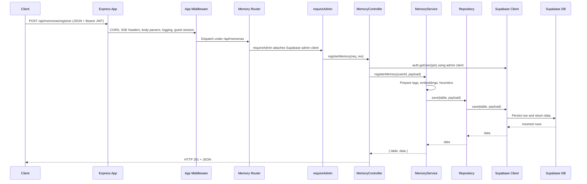

# Memory Request Flow

This document traces the end-to-end flow for a client request that stores a memory via `POST /api/memorias/registrar`, covering the hop-by-hop responsibilities from the HTTP layer to the Supabase database.

## High-level sequence



## End-to-end request pipeline

```mermaid
flowchart TD
    A[Client Request<br/>POST /api/memorias/registrar] --> B[Express createApp]
    B --> C[CORS + OPTIONS handlers]
    C --> D[Guest session & query normaliser]
    D --> E[Express Router /api/memorias]
    E --> F[requireAdmin middleware<br/>(injects Supabase admin client)]
    F --> G[MemoryController.registerMemory]
    G --> H[Supabase auth.getUser(jwt)]
    H --> I[MemoryService.registerMemory]
    I --> J[Generate tags, embeddings, heuristics]
    J --> K[MemoryRepository.save]
    K --> L[Supabase save()<br/>.select("*").single()]
    L --> M[(Supabase Database)]
    M --> |Inserted rows| L
    L --> K
    K --> I
    I --> G
    G --> |HTTP 201 + JSON| A
```

## Detailed flow description

1. **Client request.** A front end issues a `POST /api/memorias/registrar` request containing the memory payload and a `Bearer` token in the `Authorization` header.
2. **Express app bootstrap.** The Express application created in `createApp()` enables trust proxy, applies CORS early, handles universal `OPTIONS` pre-flights, registers SSE-friendly headers, attaches JSON/urlencoded parsers, annotates any incoming `X-Guest-Id` header (without granting write permission), logs the request, runs the legacy guest-session middleware, and normalises query parameters before mounting the memory routes under the `/api` prefix.【F:server/core/http/app.ts†L17-L108】
3. **Route dispatch with admin guard.** The memory router wraps all handlers with `requireAdmin`, ensuring every request receives the Supabase admin client on `req.admin`. If the environment variables are missing the middleware replies with `500 SUPABASE_ADMIN_NOT_CONFIGURED` instead of reaching the controller.【F:server/domains/memory/routes.ts†L1-L16】【F:server/mw/requireAdmin.ts†L1-L24】
4. **Authentication.** The controller reads the injected `req.admin` client and calls `admin.auth.getUser(token)` to validate the provided bearer token. Missing configuration yields a `500` response while invalid or absent tokens trigger `401 Unauthorized`, preventing guest identities from persisting memories.【F:server/domains/memory/controller.ts†L31-L79】
5. **Controller validation and delegation.** After parsing and validating the payload (ensuring `texto` and `intensidade` exist), the controller forwards the authenticated user id and request data to `MemoryService.registerMemory`. Errors are logged and surfaced as `500` responses.【F:server/domains/memory/controller.ts†L81-L126】
6. **Service orchestration.** The `MemoryService` clamps the intensity, determines whether to persist in the permanent `memories` table or the temporary `referencias_temporarias` table, normalises tags (auto-generating them if empty), computes embeddings, estimates openness, and assembles the Supabase payload before delegating to the repository.【F:server/domains/memory/service.ts†L41-L118】
7. **Repository abstraction.** The domain repository defines the contract used by the service, guaranteeing that inserts resolve to a single typed row and lists honour user/tag filters.【F:server/domains/memory/repository.ts†L1-L15】
8. **Supabase adapter and client.** The adapter uses the administrative Supabase client to insert the payload into the chosen table via `.select("*").single()` and returns the inserted row. The client itself is configured once using environment-provided URL and service role credentials, raising a `SupabaseConfigError` if they are missing.【F:server/adapters/supabaseMemoryRepository.ts†L1-L36】【F:server/lib/supabaseAdmin.ts†L1-L54】
9. **Response.** The controller forwards the service output directly, responding with `201 Created` and the `{ table, data }` payload that includes the Supabase-generated row id.【F:server/domains/memory/controller.ts†L97-L126】

## Related retrieval flow (list)

For `GET /api/memorias`, the same middleware and router chain execute, but the controller calls `MemoryService.listMemories`, which leverages the repository's `list` method to query the `memories` table via Supabase with optional tag filtering and limits before replying to the client.【F:server/domains/memory/controller.ts†L128-L170】【F:server/domains/memory/service.ts†L120-L143】【F:server/adapters/supabaseMemoryRepository.ts†L18-L36】
