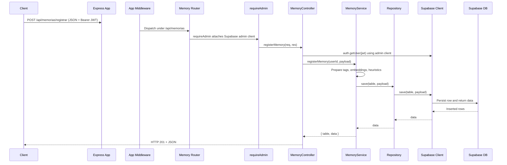
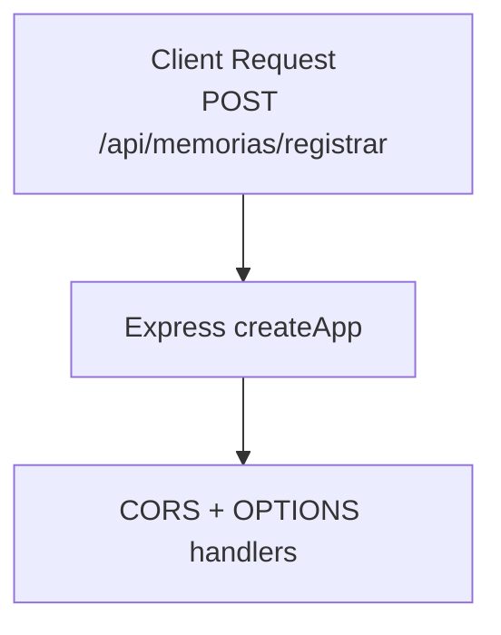

# Memory Request Flow

This document traces the end-to-end flow for a client request that stores a memory via `POST /api/memorias/registrar`, covering the hop-by-hop responsibilities from the HTTP layer to the Supabase database.

## High-level sequence

## End-to-end request pipeline

## Detailed flow description

1. **Client request.** A front end issues a `POST /api/memorias/registrar` request containing the memory payload and a `Bearer` token in the `Authorization` header.

