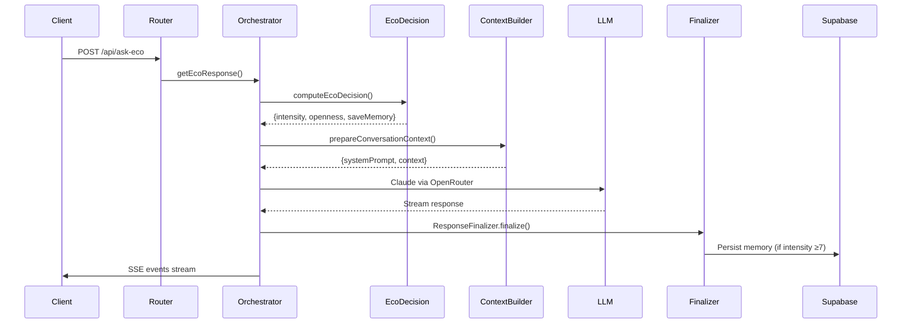
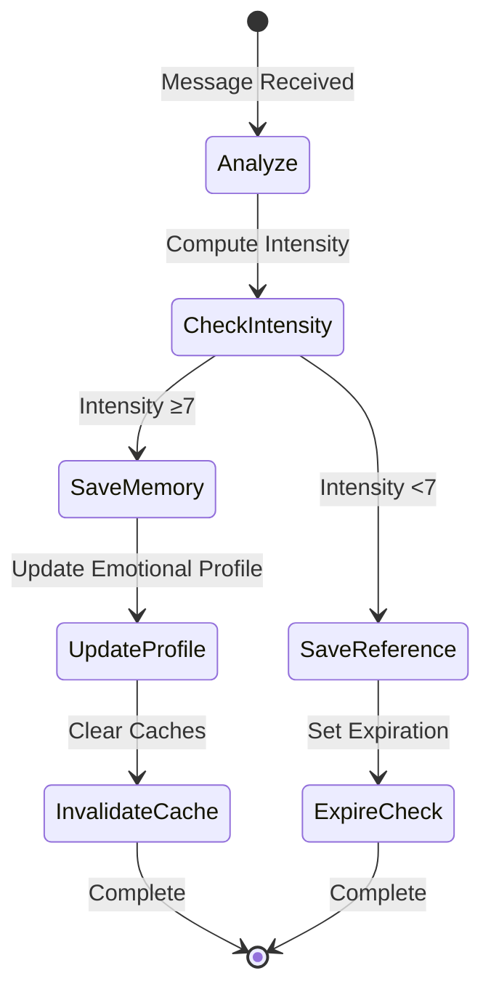

# Claude.md - ECO Backend Architecture Documentation

## Overview

The ECO system is an emotionally-aware AI assistant built on Node.js/TypeScript that implements a sophisticated conversation orchestration pipeline with persistent semantic memory, adaptive context building, and real-time streaming responses. The system analyzes emotional intensity in conversations and adapts its responses accordingly, maintaining a nuanced memory system that scales from ephemeral references to deep emotional memories.

## Table of Contents

1. [Core Architecture](#core-architecture)
2. [Request Pipeline](#request-pipeline)
3. [Emotional Intelligence System](#emotional-intelligence-system)
4. [Context Building & Prompt Assembly](#context-building--prompt-assembly)
5. [Memory & Embeddings Subsystem](#memory--embeddings-subsystem)
6. [SSE Streaming Architecture](#sse-streaming-architecture)
7. [Data Persistence Layer](#data-persistence-layer)
8. [Analytics & Telemetry](#analytics--telemetry)
9. [Security & Identity](#security--identity)
10. [External Integrations](#external-integrations)

## Core Architecture

### Technology Stack
- **Runtime**: Node.js with TypeScript
- **Framework**: Express.js for HTTP server
- **Database**: Supabase (PostgreSQL with pgvector extension)
- **LLM Provider**: OpenRouter/Claude (Anthropic)
- **Real-time**: Server-Sent Events (SSE)
- **Analytics**: Mixpanel
- **Embeddings**: OpenAI/pgvector for semantic search

### Key Design Principles
1. **Emotional Awareness**: Every interaction is analyzed for emotional intensity (0-10 scale)
2. **Adaptive Context**: Prompt construction dynamically adjusts based on emotional state
3. **Memory Persistence**: Intense emotional moments (≥7) become permanent memories
4. **Streaming First**: SSE-based responses for real-time interaction
5. **Privacy by Design**: User isolation through RLS and JWT validation

## Request Pipeline

### 1. Bootstrap & Initialization
```
server.ts → Environment validation → Module catalog → Service initialization
```

The server bootstrap process:
- Loads environment variables (`ECO_ASSETS_ROOT`)
- Initializes the module catalog for prompt assets
- Sets up auxiliary services (bandits synchronization, heuristics)
- Establishes Supabase connections (admin and service-role clients)

### 2. Express Application Setup
```
createApp() → CORS → JSON parsing → Identity middlewares → Rate limiting → Domain routes
```

The Express app applies middleware in order:
1. **CORS configuration** for cross-origin requests
2. **Conditional JSON parsing** based on content type
3. **Guest identity management** (`ensureGuestIdentity`)
4. **Authenticated identity validation** (`ensureIdentity`)
5. **Rate limiting** for anonymous requests (`guestSessionMiddleware`)
6. **Domain-specific routers** mounting

### 3. Core Routes

| Route | Purpose | Method | Response Type |
|-------|---------|--------|---------------|
| `/api/ask-eco` | Main conversation endpoint | POST | SSE/JSON |
| `/api/memorias` | Memory CRUD operations | GET/POST/PUT | JSON |
| `/api/feedback` | User feedback collection | POST | JSON |
| `/api/signal` | Passive behavior signals | POST | JSON |
| `/api/guest/claim` | Guest account association | POST | JSON |
| `/api/_eco-contract` | Service introspection | GET | JSON |
| `/api/health` | Health check & status | GET | JSON |

### 4. Conversation Orchestration Flow



## Emotional Intelligence System

### Emotional Decision Hub (`ecoDecisionHub`)

The emotional analysis pipeline evaluates each message for:

1. **Intensity Calculation (0-10)**:
   - Lexical analysis for emotional markers
   - Vulnerability detection patterns
   - Contextual weighting based on conversation history
   - Heuristic rules for specific trigger patterns

2. **Openness Level Derivation (1-3)**:
   - **Level 1 (Surface)**: Intensity < 5, no vulnerability detected
   - **Level 2 (Reflection)**: Intensity 5-6 or moderate vulnerability
   - **Level 3 (Depth)**: Intensity ≥7 with vulnerability signals

3. **Memory Decision Logic**:
   ```typescript
   if (intensity >= 7 && !isGuest) {
     saveMemory = true
     hasTechBlock = true
   }
   ```

### Technical Block Generation

When emotional intensity reaches threshold (≥7), the system generates a structured JSON block containing:

```json
{
  "emocao_principal": "string",
  "intensidade": 7.5,
  "tags": ["array", "of", "tags"],
  "dominio_vida": "trabalho|relacionamentos|saude|financas|outros",
  "nivel_abertura": 1-3,
  "analise_resumo": "Brief analysis",
  "salvar_memoria": true,
  "timestamp": "ISO 8601"
}
```

## Context Building & Prompt Assembly

### Dynamic Context Pipeline

The `ContextBuilder` implements a sophisticated multi-layer prompt assembly system:

#### 1. Module Selection Matrix
```
Base Layer → Core Modules → Advanced Modules → Heuristic Modules → Footer Sections
```

#### 2. Module Categories

| Category | Activation | Examples |
|----------|------------|----------|
| **Core** | Always active | `developer_prompt.txt`, `IDENTIDADE.txt` |
| **Behavioral** | Level-based | `nv1_core.txt`, `nv2_reflection.txt` |
| **Philosophical** | Level ≥2 | `eco_observador_presente.txt`, `eco_corpo_emocao.txt` |
| **Heuristic** | Rule-based | `eco_heuristica_disponibilidade.txt` |
| **Crisis** | High intensity | `eco_crise_sensivel.txt` |

#### 3. Context Cache Strategy

The system implements an intelligent caching mechanism:
- **Cache Key**: `ctx:<id>:<level>:<intensity>:<memoryCount>:<flags>`
- **Cache Conditions**: Level ≤2, no similar memories, stable emotional state
- **Cache TTL**: 5 minutes for hot paths, 30 minutes for stable contexts

### Memory Integration

The context builder incorporates memories through:

1. **Semantic Search**: Finding relevant past experiences
2. **Temporal Continuity**: Detecting conversation threads
3. **Emotional Resonance**: Matching emotional patterns
4. **Domain Alignment**: Prioritizing same life domain memories

## Memory & Embeddings Subsystem

### Data Model

#### Primary Tables

**`public.memories`** - Persistent emotional memories (intensity ≥7)
```sql
- id: UUID primary key
- usuario_id: User identifier (RLS enforced)
- texto: Memory content (3-3000 tokens)
- intensidade: Float 0-10
- emocao_principal: Emotion taxonomy
- tags: Text array (snake_case)
- embedding: vector(1536) - Semantic embedding
- embedding_emocional: vector(768) - Emotional embedding (optional)
- dominio_vida: Life domain enum
- created_at/updated_at: Timestamps
- pin: Boolean for manual retention
- mensagem_id: Link to original message
```

**`public.referencias_temporarias`** - Ephemeral references (intensity <7)
```sql
- Same structure as memories
- expires_at: Timestamp for automatic cleanup (max 30 days)
```

### Embedding Pipeline


### Semantic Search RPC

The `buscar_memorias_semanticas_v2` RPC implements:

1. **Multi-factor Scoring**:
   - Semantic similarity (cosine distance)
   - Emotional similarity (when available)
   - Temporal recency (exponential decay)
   - Tag overlap coefficient
   - Domain matching bonus

2. **MMR (Maximum Marginal Relevance)**:
   - Lambda parameter (default 0.5)
   - Diversity penalty for similar selections
   - Prevents redundant memory retrieval

3. **Token Budget Management**:
   - Configurable token limit
   - Priority queue by composite score
   - Truncation with ellipsis for overflow

## SSE Streaming Architecture

### Event Flow Sequence

```
1. prompt_ready → 2. first_token → 3. chunk (repeated) → 4. memory_saved → 5. done
```

### SSE Event Types

| Event | Type | Payload | Purpose |
|-------|------|---------|---------|
| `prompt_ready` | control | `{stream: true}` | Handshake confirmation |
| `first_token` | meta | `{latency_ms}` | First token metrics |
| `chunk` | token | `{index, text}` | Content streaming |
| `memory_saved` | control | `{memory_id}` | Persistence confirmation |
| `done` | done | `{done: true, stats}` | Stream termination |

### Resilience Features

1. **Heartbeat Mechanism**: Periodic `ping` events prevent timeout
2. **Idle Guard**: Automatic termination after inactivity threshold
3. **Fallback Handler**: JSON response if SSE fails
4. **Deduplication**: Active stream manager prevents concurrent requests
5. **Graceful Shutdown**: Cleanup on client disconnect

## Data Persistence Layer

### Supabase Integration

#### Connection Management
```typescript
// Analytics client (service-role)
const analyticsClient = createClient(SUPABASE_URL, SERVICE_ROLE_KEY)

// Admin client (full access)
const adminClient = createClient(SUPABASE_URL, ADMIN_KEY)
```

#### Row-Level Security (RLS)

All memory tables enforce user isolation:
```sql
CREATE POLICY "Users can only access own memories"
ON public.memories
FOR ALL
USING (usuario_id = auth.uid() OR auth.role() = 'service_role')
```

### Analytics Schema

**Core Analytics Tables**:
- `analytics.quality_metrics` - Response quality tracking
- `analytics.bandit_state` - Multi-armed bandit optimization
- `analytics.knapsack_results` - Module selection metrics
- `analytics.latency_tracking` - Performance monitoring

### Memory Persistence Flow



## Analytics & Telemetry

### Mixpanel Integration

Events tracked:
- **Message Events**: `eco_message_sent`, `eco_message_received`
- **Memory Events**: `memory_created`, `deep_question_detected`
- **Performance**: `first_token_latency`, `total_response_time`
- **User Behavior**: `session_start`, `session_end`, `feedback_submitted`

### Telemetry Pipeline

```typescript
// Asynchronous event processing
withAnalyticsFinalize(async () => {
  await mixpanel.track('eco_message', {
    intensity,
    openness_level,
    memory_saved,
    response_time_ms,
    tokens_used
  })
})
```

## Security & Identity

### Identity Management Layers

1. **Guest Identity** (`ensureGuestIdentity`):
   - Generates UUID v4 for anonymous users
   - Maintains session continuity
   - Rate limiting via sliding window

2. **Authenticated Identity** (`ensureIdentity`):
   - Validates JWT from Supabase Auth
   - Injects `X-Eco-Guest-Id` and `X-Eco-Session-Id` headers
   - Enforces UUID v4 format

3. **CORS Configuration**:
   - Whitelisted origins from environment
   - Credential support for authenticated requests
   - Preflight caching optimization

### Rate Limiting Strategy

```typescript
// Guest session limits
const RATE_LIMITS = {
  window: '15m',
  max_requests: 20,
  cooldown: '5m'
}
```

## External Integrations

### OpenRouter/Claude Integration

Configuration:
```typescript
{
  model: 'anthropic/claude-3-5-sonnet',
  api_key: OPENROUTER_API_KEY,
  temperature: 0.7,
  max_tokens: 4096,
  stream: true
}
```

Error Handling:
- Automatic retry with exponential backoff
- Fallback to cached responses when available
- Graceful degradation for non-critical features

### Supabase Services

**Used Services**:
- Authentication (JWT validation)
- Database (PostgreSQL with pgvector)
- Realtime (WebSocket subscriptions)
- Storage (media attachments)

### Module Catalog System

The system loads prompt modules from `/server/assets`:
```
assets/
├── core/           # Always active
├── behavioral/     # Level-based
├── philosophical/  # Advanced features
├── heuristic/      # Rule-triggered
└── crisis/         # High-intensity
```

## Performance Optimizations

### Caching Strategies

1. **Context Cache**: Reuses computed prompts for similar requests
2. **Embedding Cache**: Stores frequently accessed embeddings
3. **Module Cache**: Pre-loads and indexes text modules
4. **Response Cache**: Stores common responses for quick retrieval

### Parallel Processing

```typescript
// Parallel fetch for context preparation
await Promise.all([
  generateEmbedding(message),
  fetchHeuristics(context),
  searchMemories(embedding),
  checkContinuity(session)
])
```

### Database Optimizations

- **HNSW Indexes**: Fast approximate nearest neighbor search
- **Partial Indexes**: Filtered by user_id and created_at
- **Connection Pooling**: Managed by Supabase client
- **Batch Operations**: Bulk inserts for analytics

## Monitoring & Observability

### Health Checks

The `/api/health` endpoint provides:
- Service status
- Database connectivity
- Module catalog state
- Active stream count
- Memory usage metrics

### Debug Features

Environment-based debugging:
```typescript
if (ECO_DEBUG === 'true') {
  // Verbose logging
  // Request/response inspection
  // Performance profiling
}
```

### Error Recovery

1. **Circuit Breaker**: Prevents cascade failures
2. **Dead Letter Queue**: Captures failed operations
3. **Automatic Retries**: With exponential backoff
4. **Graceful Degradation**: Falls back to basic responses

## Development Guidelines

### Code Organization

```
server/
├── controllers/     # Request handlers
├── services/        # Business logic
├── middleware/      # Express middleware
├── routes/          # Route definitions
├── core/           # Core utilities
├── analytics/      # Telemetry logic
├── sse/           # Streaming components
└── assets/        # Prompt modules
```

### Testing Strategy

- **Unit Tests**: Service and utility functions
- **Integration Tests**: API endpoints
- **Load Tests**: SSE streaming performance
- **E2E Tests**: Full conversation flows

### Deployment Considerations

1. **Environment Variables**: Properly configured secrets
2. **Database Migrations**: Supabase CLI managed
3. **Module Assets**: Verified and indexed
4. **Health Monitoring**: Uptime checks configured
5. **Log Aggregation**: Centralized logging setup

## Conclusion

The ECO backend represents a sophisticated emotional AI system that combines real-time streaming, semantic memory, and adaptive context generation. Its layered architecture ensures scalability, maintainability, and user privacy while delivering emotionally intelligent responses. The system's ability to persist and retrieve contextually relevant memories, combined with its dynamic prompt assembly, creates a uniquely personalized conversational experience that deepens over time.
